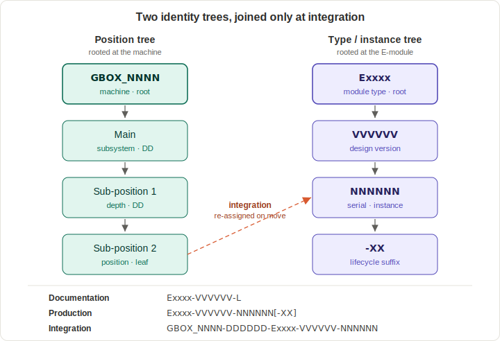

<!--
SPDX-FileCopyrightText: 2026 The IndustryGrow contributors
SPDX-License-Identifier: CC-BY-SA-4.0
-->

# ADR-0017 (rev 1): Component, document, and instance identification scheme

- **ID:** ADR-0017 (rev 1)
- **Status:** Accepted
- **Date:** 2026-06-19
- **Project:** IndustryGrow
- **Parent:** ADR-0001
- **Companions:** ADR-0002 (rev 3), ADR-0004 (rev 1), ADR-0007, ADR-0014, ADR-0015, ADR-0016
- **Supersedes:** ADR-0017 (initial, 2026-05-31)

## Revision history

- **rev 1 (2026-06-19)** — Adopts the firmware document layer `F` into the scheme
  (previously a maintainer-call extension recorded only in `REGISTRY.md`) and
  **roots it on the carrier `E0001`, not the node module**. The firmware is one
  codebase shared by every node type (ADR-0002 d5), selected at runtime by the
  module-ID strap; its version tracks that single carrier-level codebase, so
  filing it per-module (the prior `E0006-…-F` convention) would force one shared
  code change to bump the `F` version of every module — a count-into-identity
  leak. Adds decision 16 and alternative G. Also refreshes companion references:
  ADR-0005 and ADR-0007 are now Accepted (were "planned").

## Context and problem

IndustryGrow produces physical artifacts and documentation across a lifecycle (design → production/QC → integration → operation) and across deployment scales (apartment cabinet to commercial greenhouse). The architecture already commits to a strong shape: a small set of reusable PCB designs (carrier, M01–M05 per ADR-0014), instantiated many times, with instances that **move between deployments** as inventory (ADR-0016). What it has not committed to is how those artifacts and their documents are **identified**.

The existing ADRs supply a taxonomy — module classes M01–M05, module-ID straps, the carrier as a distinct host board — but not material numbers, serial numbers, document identifiers, or a way to address per-instance lifecycle documents (test data, calibration, provisioning). Without a scheme, traceability is ad-hoc, procurement and QC records have no canonical key, and the inventory/mobility model of ADR-0016 has nowhere to hang an instance's history.

This ADR specifies a hierarchical identification scheme for IndustryGrow. Its organizing principle is the separation of three things the project needs kept apart: the **type** (a module designation plus a version), the **instance** (a serial number), and the **position in the machine** (a hierarchical depth code). The scheme uses phase-specific identifier formats so that an artifact's identifier reflects where it is in its lifecycle, and it reserves a suffix slot for per-instance lifecycle documents.

The separation is load-bearing for two reasons specific to IndustryGrow. ADR-0014 requires that one design be instantiated many times (designs few, instances many); ADR-0016 requires that an individual instance physically move between positions and deployments while keeping its identity and history. An identifier that fused type with position, or instance with position, would break both. This ADR also fixes the bindings that connect the scheme to the rest of the architecture: the instance serial to the ATECC608 hardware identity (ADR-0007), the document interface layer to Cyphal/DSDL (ADR-0002/0005), the integration-phase depth code to the gateway's runtime position tagging (ADR-0014 decision 7), and the suffix set to IndustryGrow's actual per-instance documents — together with the boundary between those documents and IndustryFlow's operational audit log (ADR-0004 rev 1). Rev 1 adds one further binding: the firmware document layer to the single shared codebase that runs on the carrier, so firmware identity follows the carrier (`E0001`), not the node personality (decision 16).

## Decision drivers

- **Reuse the existing taxonomy; do not reinvent it.** M01–M05 and the module-ID straps (ADR-0014) are already a stable type vocabulary. The identifier scheme must encode that vocabulary, not run parallel to it.
- **Separate type, instance, and position.** Load-bearing because of ADR-0014 (one design, many instances at many positions) and ADR-0016 (an instance physically moves between positions and deployments over its life).
- **Reuse hardware identity already present.** Every carrier carries an ATECC608 (ADR-0002 rev 3 decision 3). Instance identity should bind to it rather than to a second, invented serial authority.
- **One scheme across disciplines.** Electrical, mechanical, and pneumatic/fluidic parts of IndustryGrow should share one identification scheme, not fork per discipline.
- **Do not duplicate the operational audit trail.** IndustryFlow already holds firmware events, telemetry, and forensic history (ADR-0004 rev 1). The document store must not become a second, divergent record of the same things.
- **Lifecycle documents belong to the instance, not the position.** A board's test, calibration, and provisioning history must follow its serial across re-installations.

## Decision

## Conceptual model (governing invariant)

Identity has two orthogonal axes that never fuse:

- **Identity axis** — *what a thing is, and which copy.* Rooted at the
  E-module: `Exxxx → VVVVVV → NNNNNN`. Assigned at design / production.
  Position-free.
- **Position axis** — *where a thing physically sits.* Rooted at the machine:
  `GBOX_NNNN → DDDDDD`. Assigned at integration. Identity-free.

The axes meet only in the integration identifier
`GBOX_NNNN-DDDDDD-Exxxx-VVVVVV-NNNNNN`, a *mutable cross-reference* re-assigned
whenever an instance is moved, removed, or replaced. A serial never encodes
position; a position never encodes identity.

A third notion — the **document layer** (`S/D/L/P/M/I`, plus `F` for firmware,
decision 16) — is not an axis but a classifier on the identity axis (which
artifact about a given identity); it never denotes nesting.

Every numbered decision below is a consequence of this invariant. The rejected
alternatives (flat hierarchical serial; position baked into serial) are exactly
the collapse of these two axes into one, which the invariant forbids because
instances are mobile and interchangeable (ADR-0014, ADR-0016).

> Terminology for this ADR is governed by `GLOSSARY.md`.



### Identifier formats

1. **Three phase-specific identifier formats.**
   - Documentation (design artifacts, type-level): `Exxxx-VVVVVV-L`
   - Production & QC (a manufactured instance): `Exxxx-VVVVVV-NNNNNN[-suffix]`
   - Integration (an instance installed in a machine): `GBOX_NNNN-DDDDDD-Exxxx-VVVVVV-NNNNNN`

   Decoded:

   ```
   Documentation  (type-level)
   Exxxx-VVVVVV-L
   │     │      │
   │     │      └─ document layer (S, D, L, P, M, I)
   │     └─ version, 6 digits (major.minor.patch)
   └─ module, E + 4 digits

   Production & QC  (one manufactured instance)
   Exxxx-VVVVVV-NNNNNN-XX
   │     │      │      │
   │     │      │      └─ lifecycle suffix (QP, QR, CP, CC, PR)
   │     │      └─ serial, 6 digits (per module + version)
   │     └─ version, 6 digits
   └─ module, E + 4 digits

   Integration  (instance installed in a machine)
   GBOX_NNNN-DDDDDD-Exxxx-VVVVVV-NNNNNN
   │         │      │     │      │
   │         │      │     │      └─ serial (from production)
   │         │      │     └─ version, 6 digits
   │         │      └─ module, E + 4 digits
   │         └─ depth, 6 digits (position in machine)
   └─ machine, GBOX + 4 digits

   Two encoded fields carry sub-structure:
   VVVVVV  =  major.minor.patch   (2 digits each)        e.g. v2.1.3 = 020103
   DDDDDD  =  main.sub-L1.sub-L2  (2 digits each, main 01–99)
              e.g. climate node at position 1.1 = 010100
   ```

   Field definitions:
   - **Module** `Exxxx` — `E` plus four digits; identifies a buildable/documentable assembly (decision 3). An opaque key; meaning is held in the registry.
   - **Version** `VVVVVV` — six digits encoding semantic version `major.minor.patch`, two digits each (`1.0.0` → `010000`, `2.1.3` → `020103`). This is the version of the *design*, not of a populated configuration (see alternative D).
   - **Serial** `NNNNNN` — six digits, unique per module+version (`000001`–`999999`). Assigned in Production. The width is sized to the largest declared deployment's lifetime install base of a single design+version — most acutely the universal carrier, which has one near-static version and therefore accumulates the most serials — so the range is not exhausted in practice. There is deliberately **no** overflow-into-version mechanism: bumping the patch when a range fills would leak instance *count* into the design *version*, the same corruption alternative D rejects, and would not even buy more headroom than simply widening the field (see decision 8 and alternative D).
   - **Depth** `DDDDDD` — six digits in three two-digit levels (main / sub-position 1 / sub-position 2), encoding the position within the machine hierarchy. Position only; assigned at integration, never present in the production identifier (decision 7).
   - **Document layer** `L` — a single letter naming the document type (decision 9).
   - **Suffix** — a per-instance lifecycle-document tag appended in the production identifier (decisions 10–14).

   Documents are stored flat, with the hierarchy carried entirely in the identifier, so the store can be filtered by identifier pattern (all documents of one module, all reports, all instances at a given position, and so on). The store is realized as an object store, where this filtering is a key-prefix list (decision 15).

2. **Two distinct instance histories, one of which this ADR governs.** Static, per-instance *documents* (test data, calibration, provisioning records) live in the document store and are addressable by suffix. *Operational/runtime events* (firmware-flash events, telemetry, control-decision audit, hash-chain) live in IndustryFlow's audit log per ADR-0004 rev 1 decisions 10 and 16. The two are not merged and not duplicated. Suffixes (decisions 10–14) address only the former.

### Code legend

The single key to the trailing letter codes in an identifier: the **document-layer** letter in the type-level form `Exxxx-VVVVVV-L` (e.g. the `D` in `E0001-000001-D.png`, the `L` in `E0001-000001-L.csv`) and the **lifecycle suffix** in the instance form `Exxxx-VVVVVV-NNNNNN-XX`. This table is the one place the codes are expanded; the cited decisions hold the definitions and rules, not a second copy of the mapping. Both sets are extensible — add a code by appending a row here; suffix codes are two uppercase letters and must not collide with the document-layer letters.

| Code | Meaning | Field | Defined in |
|------|---------|-------|------------|
| `S`   | Schema | document layer | decision 9 |
| `D`   | Drawing | document layer | decision 9 |
| `L`   | List / BOM | document layer | decision 9 |
| `P`   | Protocol | document layer | decision 9 |
| `M`   | Manual | document layer | decision 9 |
| `I`   | Interface | document layer | decision 9 |
| `F`   | Firmware (built image + source snapshot) | document layer | decision 16 |
| `-QP` | Quality Protocol | lifecycle suffix | decision 10 |
| `-QR` | Quality Report | lifecycle suffix | decision 10 |
| `-CP` | Calibration Protocol | lifecycle suffix | decision 11 |
| `-CC` | Calibration Certificate | lifecycle suffix | decision 11 |
| `-PR` | Provisioning Record | lifecycle suffix | decision 12 |

### Module designation (E-numbers)

3. **An E-number identifies a buildable/documentable assembly.** The existing taxonomy maps directly: the carrier and each of M01–M05 are buildable assemblies and each receives an E-number. A **functional subsystem** (climate, lighting, irrigation, plant monitoring, pollination, power/safety per ADR-0001 decision 7) is *not* an E-number — it is a **position** in the machine, expressed as a depth code (decision 7). The WeAct STM32F4 core board is a purchased sub-component identified by an `SP` number, not an E-number (ADR-0019). One further bounded carve-out: a *designed* accessory that has no existence apart from one specific part (a printed case, a bracket, a mount) does **not** take its own E-number — it rolls up under the served part's root as a `D`-layer document (ADR-0019 decision 9); a designed assembly that stands alone or is serialized still does (decision 4, decision 5).

4. **Bare-PCB design and populated assembly are distinguished.** One PCB *layout* is one bare-board design artifact; each standard *populated configuration* of that layout is an assembly E-number that references the shared bare design. This resolves the partial-BOM mechanism of ADR-0014 decision 2 without adding a variant field to the scheme:
   - **Carrier:** one bare design and effectively one assembly. Termination is jumper-selected and the power-input set is the only populate option, so the carrier is treated as a single assembly E-number — one type, one version, many serials, appearing at many depth positions. (This was the original motivating case: the carrier is universal precisely because it has no real variant.)
   - **M01–M05:** one bare design each; in Phase 1 one fully-populated assembly E-number each. Zone-specific partial populations in Phase 2 (ADR-0014 decision 2) receive **additional assembly E-numbers referencing the same bare design** — no new layout, no version churn.

5. **Discipline (electrical / mechanical / pneumatic / fluidic) is a property of the E-module, not a field in the identifier.** It is expressed through decomposition — each discipline-specific buildable unit is its own E-number at its own depth sub-position — and recorded as registry metadata. The identifier stays opaque, with meaning held in the registry. Encoding discipline by partitioning the E-number range (e.g. reserving leading digits per discipline) is **reserved as an option** for the case where pattern-filtering by discipline across the document store becomes necessary; it is not the default.

### Machine designation and position

6. **The cabinet machine (ADR-0001 decision 7) is designated `GBOX_NNNN`** (Grow Box). The machine designation has the general form `<prefix>_NNNN` — four digits, enumerating grow-cabinets across the product (a deployment-scaling field, sized like the serial against the largest declared deployment rather than a single apartment cabinet). The `GBOX` prefix is specific to IndustryGrow grow-cabinet machines, leaving room for other machine families under their own prefixes should the scheme be reused elsewhere.

7. **The integration-phase depth code is the static twin of gateway-side position tagging.** The depth code encodes the same information the gateway resolves at runtime as `(module_class, node_role, zone)` and `production_unit` (ADR-0014 decision 7; ADR-IF-0001, planned). Position is assigned at integration and **never** appears in the production identifier. This preserves instance interchangeability (ADR-0014) and instance mobility between deployments (ADR-0016): the same `Exxxx-VVVVVV-NNNNNN` can be installed at many different depth positions over its life. The depth code's two-digit-per-level width (main `01`–`99`) is intentionally *not* widened with the serial and machine fields: depth is intra-machine, bounded by one cabinet's physical decomposition (~6 functional subsystems per ADR-0001 decision 7), not by deployment size. Scaling a commercial facility means more serials and more `GBOX` machines, each carrying its own depth space — never a deeper hierarchy inside one box. The sizing principle across the scheme is "size to the largest declared deployment," and for depth the largest single machine is already covered with wide margin.

### Instance identity

8. **The serial number is the logistics instance key; the ATECC608 is the cryptographic instance identity.** The serial (six digits, unique per module+version, `000001`–`999999`, with no overflow-into-version — the field is widened instead, see decision 1 and alternative D) is the human- and store-facing instance key. The durable cryptographic identity is the ATECC608 plus its provisioned certificate (ADR-0007). The two are bound to each other in the provisioning record (decision 12); no separate serial authority is invented. Serials are assigned in Production (Phase 2).

### Document layers

9. **Document-layer set `S` / `D` / `L` / `P` / `M` / `I`** — expanded in the code legend above. Two IndustryGrow-specific bindings: the **`I` (Interface)** document layer carries Cyphal subject-ID assignments and DSDL `industryflow.greenhouse.*` type definitions (ADR-0002 rev 3 decision 1; ADR-0005); the **`L` (List)** document layer carries the per-module BOMs already drafted in the procurement and sensor-module documents. **Rev 1** extends the set with **`F` (Firmware)** — the built node image and its source snapshot — whose carrier-rooted addressing is decision 16.

### Suffixes (per-instance lifecycle documents)

10. **`-QP` / `-QR`.** `-QP` (Quality Protocol) is the raw bring-up and functional-test data for an instance (DFU flash, bxCAN init, Cyphal heartbeat, sensor-presence I²C probing, functional run against bench stimuli). `-QR` (Quality Report) is the evaluated result and acceptance. Discipline-specific test content (dimensional inspection for mechanical, leak/pressure test for pneumatic) lives *inside* the QP document; the suffix code stays generic. No `QP`-electrical / `QP`-pneumatic proliferation.

11. **`-CP` / `-CC`, mirroring the protocol/report pattern.** `-CP` (Calibration Protocol) holds the raw calibration points; `-CC` (Calibration Certificate) holds the resulting coefficients and validity period. Primary driver is M03-ANALYTICS (pH against buffers 4/7/10, EC against 1413 µS/cm) plus any sensor offset trims. Unlike QC, **calibration recurs** (probe drift, scheduled recalibration), so calibration suffixes are dated or sequenced — `-CC-YYYYMMDD` or `-CCnnn` — so a later calibration does not overwrite an earlier record. Deployment-level model calibration (ADR-0016 state-space identification) is explicitly *not* a calibration suffix; it is profile-versioned per ADR-0015 (see decision 13 and the alternatives).

12. **`-PR` (Provisioning Record).** Binds the ATECC608 to its issued certificate and holds the certificate metadata (ADR-0007) — the instance's "birth certificate." It contains the public material only; the private key never leaves the ATECC608. Restricted to engineering/quality access.

13. **Suffixes attach to the instance identifier, never to the integration identifier.** Lifecycle documents key off `Exxxx-VVVVVV-NNNNNN`, which is stable; the integration identifier merely records where the instance currently sits and changes when the instance is moved. This is mandatory under ADR-0016's inventory model: when a board is redeployed, its QP/QR/CP/CC/PR history follows its serial, and a recalibration at the new deployment adds a new dated `-CC` to the same serial — not a record on the new position.

14. **M03 probes are their own instances.** The pH electrode and EC cell are replaceable consumables with independent drift and replacement life, so each is its own E-number with its own serial and its own calibration history. The M03 board's calibration record references the paired probe serial, so the board+probe pairing and the probe's standalone history are both reconstructible.

### Storage backend and object-store mapping

15. **The document store is an object store; identifiers are object keys.** The flat layout (decision 1) is chosen for object storage (S3-compatible buckets), not a hierarchical filesystem. Each artifact is a single object whose key *is* its identifier (`E0001-000001-L.csv`, `E0001-000001-D-Top_Layer.gtl`, a `-CC-YYYYMMDD` calibration certificate, and so on); there are no container objects and no real directories. The identifier-pattern filtering of decision 1 *is* the bucket's prefix listing (`ListObjectsV2(Prefix=…)`), executed server-side with no separate index to maintain. The object-store mechanics this enables — on-demand hierarchy synthesis via a delimiter, write-once / versioning for the immutable QC and provisioning records, and prefix-scoped retention and access policy — are deployment specifics (see Deferred decisions); a git checkout renders the same flat keyspace as a flat directory, which is incidental.

    > **Bounded exception (decision 17, added 2026-06-21).** One-object-per-identifier governs *live* objects only. A **withdrawn** artifact set — blocked (defective) or superseded, possibly just the defective layout-and-fabrication subset of a version — collapses to a single archive object `Exxxx-VVVVVV-{BLOCKED,SUPERSEDED}.zip`, retaining the artifacts for history while removing the per-file clutter the flat store would otherwise carry for dead objects. The archive is a frozen container for dead artifacts, not a live document, so it does not reopen the no-container-objects rule for current work.
    >
    > **Bounded exception (decision 18, added 2026-07-18).** A second, *live* set collapses to one object: the **fabrication package** — the gerber and drill set of a board version — is a single `Exxxx-VVVVVV-D-fab.zip` object, not loose per-file objects. Unlike the withdrawn archive this is a current, in-use artifact; it is one object because the package is one indivisible manufacturing deliverable (decision 18), not because its contents are dead. The other `D`-layer faces (placement `-D-pos.csv`, render `-D.png`, pin map `-D-pinmap.md`) and the BOM `-L.csv` stay loose.

### Firmware document layer

16. **The firmware document layer `F` roots on the carrier (`E0001`), not the node module.** The node firmware is a single codebase (`firmware/`) shared by every node type — `common/` is the carrier support, `nodes/<type>/` are personalities selected at runtime by the module-ID strap (decision 7; ADR-0014 d6). The personality is a hardware/runtime attribute, not a separate codebase, so the firmware's `F` version tracks the one carrier-level codebase: `E0001-VVVVVV-F[.hex|-src.zip]`. `VVVVVV` is the firmware (codebase) version, independent of the `E0001` *board* design version — a firmware release bumps `F` without re-spinning the carrier PCB. Filing the firmware per-module (e.g. `E0006-…-F`) would make a single change to shared code bump the `F` version of every module that runs it, leaking a code-change count into N module identities — the same corruption decision 8 and alternative D forbid for serial-into-version. If per-type binaries are ever built from this one codebase they are build *variants* of the same versioned source (`E0001-VVVVVV-F-<type>`), not separate `F` roots. The `F` artifacts are reference firmware licensed AGPL-3.0-or-later (ADR-0002 d5), overriding the CERN-OHL-S `store/**` hardware default (`REUSE.toml`). The concrete file-naming form is recorded in `REGISTRY.md` (the *what*); this decision is the *why* and the root.

### Withdrawn design versions (blocked / superseded)

17. **A withdrawn design artifact set is archived as one object, and its status is named in that object's key.** Design artifacts of a version (`Exxxx-VVVVVV`) are withdrawn from use for two reasons: they are **blocked** — defective, and must never be fabricated or relied on — or **superseded** — replaced, with no defect. The withdrawn artifacts are bundled into one archive object and their loose per-file objects removed:

    ```
    Exxxx-VVVVVV-BLOCKED.zip       defective artifacts, withdrawn   (e.g. E0001-000001-BLOCKED.zip)
    Exxxx-VVVVVV-SUPERSEDED.zip    non-defective artifacts, replaced
    ```

    - **Withdrawal is scoped to the defect, not blindly to the whole version.** A defect is often localized to one production stage. The motivating case — `E0001-000001`, the carrier v0.0.1 — has a defect *in the layout only*: the PCB **mirrors the WeAct core-board socket footprint**, reversing the pin order on the sockets so every WeAct signal lands on the wrong net (the board as laid out is unbuildable), while the **schematic is correct**. So the block archives the defective **layout source and every fabrication output derived from it** (gerbers, drills, placement, render), and the still-valid **schematic** (`S`), its **BOM** (`L`), and the **pin map** stay loose — they are the live basis for the corrected relayout (a new version). A version with no salvageable artifact (a full supersession) archives all of them.
    - **Supersession reissues the full face set.** A successor version reissues the *complete* face set under its own identifier — schematic, BOM, pin map, layout, and fabrication outputs — even for faces byte-identical to the prior version (only the embedded version field differs). Each artifact's object key *is* its full identifier (decision 15), so versions never share a face by reference; the predecessor's now-stale loose faces are then archived as a `SUPERSEDED` set. (Example: `E0001-000002` reissues `-L.csv` and `-D-pinmap.md` byte-for-byte from `000001`, whose loose faces move into `E0001-000001-SUPERSEDED.zip`.)
    - **Status token in the key.** `BLOCKED` / `SUPERSEDED` sit in the trailing slot a document-layer letter would occupy, but are full uppercase words — deliberately neither the single document-layer letters (`S/D/L/P/M/I/F`, decision 9/16) nor the two-letter lifecycle suffixes (`-QP/-QR/…`, decisions 10–14), so a status token can never be mistaken for either. The token *is* the machine-readable status; `REGISTRY.md` holds the human-readable reason and the precise file boundary (ADR-0000 d2 — this ADR owns the *why*, the registry owns the *what*).
    - **Identity axis only; firmware is never swept in.** The firmware document layer `F` is independently versioned and rooted on the carrier (decision 16) — a blocked *board* design does not block the firmware *codebase*, so `Exxxx-VVVVVV-F.*` objects are **never** bundled into a board-design archive even when they share the `Exxxx-VVVVVV` prefix.
    - **One immutable archive per withdrawal.** This collapses the dead artifacts to a single object, the bounded exception noted on decision 15. The one-object-per-identifier rule continues to hold for every live object.

    **Procedure (the *how*).** Archiving a withdrawn artifact set:

    1. **Confirm the withdrawal and its scope.** Decide the status (`BLOCKED` = defective, must never be used; `SUPERSEDED` = replaced, no defect) and which artifacts are actually dead. Localize to the defect: if only the layout is wrong, keep the schematic, BOM, and pin map loose as the basis for the relayout. **Close any editor** holding the files first (a KiCad session leaves `~*.lck` locks — archiving while open risks the editor rewriting them).
    2. **Bundle the withdrawn artifacts** into `Exxxx-VVVVVV-<STATUS>.zip` — for a bad layout, the layout source (`.kicad_pcb`) and every generated fabrication output (gerbers, drills, placement `-D-pos`, render `-D.png`). **Exclude** the firmware `-F.*` objects (a separate axis) and any still-valid sources kept loose.
    3. **`git rm` the loose per-file objects** now inside the archive, leaving the one `.zip` plus the objects kept loose.
    4. **Record it** by adding a row to the blocked/superseded table in `REGISTRY.md` (the *what*) with the scope and concrete reason.
    5. **Licensing.** The `.zip` is hardware design content, covered by the `store/**` CERN-OHL-S default in `REUSE.toml` (it does not match the `-F-src.zip` AGPL override) — no `REUSE.toml` change needed.
    6. **Ship** via branch → PR; the maintainer accepts (ADR-0000 d7).

    Recorded here as an additive in-place amendment to rev 1 — a new packaging rule plus a bounded qualification of decision 15 — rather than a fresh revision, per the project's partial-supersession-by-inline-note practice (ADR-0000 d5). The per-version record (the *what* — each withdrawal's status, archive object, and exact file boundary) lives in `REGISTRY.md`.

### Live fabrication package

18. **The live fabrication package is one zip object, `Exxxx-VVVVVV-D-fab.zip`, not loose per-file gerber/drill objects.** A board version's fabrication outputs are the gerber layer set (copper, silkscreen, soldermask, paste, edge cut) plus the drill files (PTH / NPTH, and any drill-map). These are stored as a **single** `D`-layer object — `E0006-000001-D-fab.zip` — rather than one object per gerber. This is a bounded exception to decision 15's one-object-per-file rule, mirroring the packaging move of decision 17 but for a *live* artifact.

    - **Why one object.** The gerber/drill set is one indivisible manufacturing deliverable. No individual gerber has a lifecycle of its own — the copper layer is never fetched, versioned, or superseded apart from the set; a fab house (JLCPCB) and every CAM tool consume and re-spin the whole package as a unit, and upload it as a single archive. The set's *identity* is the package, so the package is the object and its key is `-D-fab` (the identifier of decision 1 is satisfied by the package, not by each plotted file). The loose-per-file alternative gave the store ~11 objects that only ever move together — clutter with no addressing benefit, since no query ever wants one gerber alone.

    - **Scope — only the gerber/drill set collapses.** The other `D`-layer faces stay loose, because each *is* separately consumed and separately addressable: the placement/centroid `-D-pos.csv` (the CPL — uploaded to assembly as its own file), the render `-D.png` and the pin map `-D-pinmap.md` (human documents). The BOM `-L.csv` is a different document layer entirely and likewise stays loose. This split is exactly the fab house's own upload flow: one gerber zip **+** a separate CPL **+** a separate BOM. So `E0006-000001` carries `-D-fab.zip`, `-D-pos.csv`, `-D.png`, and `-L.csv` as four objects, not fourteen.

    - **Internal naming is frozen-as-plotted.** The canonical identity is the *object key* (`-D-fab.zip`); the file names *inside* the zip are whatever the plot produced for that board and are not re-canonicalized (KiCad's plot-name vocabulary differs by settings — `Top_Layer` vs `F_Cu` — and rewriting gerber file names to unify them buys nothing while risking their embedded `G04` name comments). Two boards' fab zips may therefore hold differently-named members; only the key is uniform.

    - **Supersedes the prior flat listing; applied retroactively.** This overrides the earlier "fabrication outputs are filed flat, one object per file, no live `.zip`" rule recorded in `REGISTRY.md`. The one already-released board stored the old way — the carrier `E0001-000002` — has its loose gerbers/drills bundled into `E0001-000002-D-fab.zip` and the loose objects removed, so the store is uniform (alternative H). Licensing is unchanged: the `.zip` is hardware design content under the `store/**` CERN-OHL-S default (`REUSE.toml`), not the `-F-src.zip` AGPL override.

    Recorded as an additive in-place amendment to rev 1 (a bounded qualification of decision 15, like decision 17), not a fresh revision, per the project's partial-supersession-by-inline-note practice (ADR-0000 d5). The concrete descriptor (`-D-fab`) and the per-board fab-object record live in `REGISTRY.md` (the *what*); this decision is the *why*.

## Alternatives considered

**A. A flat identifier — a single serial namespace that does not separate type, instance, and position.** *Rejected:* cannot express that one design has many instances (ADR-0014) or that an instance moves between positions and deployments (ADR-0016) without overloading a single number, and loses the ability to address type-level documents and per-instance documents distinctly. The type/instance/position split is the whole point.

**B. Encode discipline in the identifier by default** (range partition or a dedicated field). *Rejected as default:* the identifier is opaque with meaning in a registry; discipline-via-decomposition-plus-metadata is consistent with that and avoids rigid range allocation. Range-partitioning is retained as an option (decision 5) for the day discipline pattern-filtering is actually needed.

**C. Bake position (zone/role/slot) into the part or serial number.** *Rejected:* breaks instance interchangeability (ADR-0014) and instance mobility (ADR-0016). Position belongs in the integration identifier / gateway tagging and is assigned at integration.

**D. Treat each populated-BOM variant as a new Version.** *Rejected:* Version is semantic versioning of the *design*; folding a populate-variant into it corrupts version semantics and the rollback story. A distinct assembly E-number referencing the shared bare design (decision 4) is the correct home. The same reasoning forbids an overflow-into-version mechanism on the serial (decision 1, decision 8): a two-digit patch over 999 serials addresses only ~10⁵ instances before the overflow climbs into the minor and major version, whereas a six-digit serial addresses ~10⁶ honestly and never touches the version. The serial is widened, not overflowed.

**E. Record firmware/telemetry history as document-store suffixes.** *Rejected:* ADR-0004 rev 1 decisions 10 and 16 already route these to IndustryFlow's audit log. A parallel document record creates two sources of truth for the same events.

**F. Issue a fresh serial when a board moves to a new deployment.** *Rejected:* the serial is the durable instance key bound to the ATECC608; mobility (ADR-0016) must preserve instance history. A move produces a new integration record and (typically) a new dated calibration record on the *same* serial.

**G. File firmware per node module (`E000x-F`), under the module whose personality it runs.** The initial convention (a maintainer call recorded in `REGISTRY.md`, 2026-06-17): the M05 image filed under `E0006`. *Rejected on rev 1:* it conflates the built binary with the codebase. The firmware is one shared tree (`firmware/`) selected at runtime by the module-ID strap, so rooting `F` per-module means a single change to shared code bumps the `F` version of every module that embeds it — the same count-into-identity leak that decision 8 and alternative D reject for serial-into-version. The carrier (`E0001`) is the single codebase's hardware home and the constant across node types, so `F` roots there (decision 16); per-type images, if ever built, are version *variants* of that one root, not new roots.

**H. Keep the fabrication outputs as loose per-file objects** (one object per gerber and drill, the store's original rule). *Rejected on the decision-18 amendment:* the gerber/drill set is one indivisible manufacturing deliverable with no per-file lifecycle — the ~11 objects only ever move, version, and re-spin together, so per-file addressing carries clutter without a single query that benefits from it. A gerber is never fetched, superseded, or licensed apart from its set. The set's identity is the package, so the package is the object (decision 18). The genuinely separable faces — placement, render, pin map, BOM — are *not* swept into the zip precisely because they *are* separately consumed (alternative retained only for those). This is the same bounded packaging move decision 17 makes for withdrawn sets, applied to a live one.

## Consequences

### Positive

- One identification scheme spanning IndustryGrow's disciplines — uniform tooling, training, and document store.
- Type, instance, and position are cleanly separated, so ADR-0014's multi-instance scaling and ADR-0016's inventory mobility are supported natively rather than bolted on.
- Instance identity reuses hardware already populated on every carrier (ATECC608); no parallel serial-number authority to operate.
- Per-instance lifecycle documents follow the instance — calibration and provisioning history survive redeployment, which is precisely what the inventory model needs.
- Clean boundary with IndustryFlow: the document store holds static documents, the platform holds operational events, with no duplicated forensic trail.
- Cyphal/DSDL definitions fall naturally into the `I` document layer; module BOMs into the `L` document layer — no new artifact categories invented.
- Flat storage with identifier-pattern filtering works directly on IndustryGrow artifacts, and maps onto object storage natively — identifiers are object keys and pattern filters are prefix lists (decision 15), so the store needs neither a real hierarchy nor a separate index.

### Negative

- **The registry becomes a critical asset.** Because identifiers are opaque, the `Exxxx → meaning / discipline / bare-design` mapping must be maintained and backed up; losing it makes identifiers hard to interpret.
- **This ADR and the registry are the canonical definition of the scheme** — there is no separate specification document. Validation and parsing tooling (identifier regexes, encoders) must be implemented directly from the field formats given here.
- **The assembly E-catalog grows with zone-specific populations** at medium and large scale (one assembly E per standard population). Manageable, but a real catalog-management surface — most acute exactly where ADR-0014's partial-BOM mechanism is most used.
- **Calibration requires dating/sequencing discipline in the suffix** (decision 11) — a process requirement, not just a format choice, with a validity-period policy still to set.
- **Treating M03 probes as their own instances** adds traceability bookkeeping for consumables; justified by their independent calibration and replacement life, but it is extra records.
- **The integration identifier has no suffix slot by design.** Operators must understand that the durable document key is the instance (`Exxxx-VVVVVV-NNNNNN`), not the current position — counterintuitive for anyone used to position-centric records.

## Relationship to other ADRs

- **ADR-0001** (machine/module data model) — the cabinet `machine` is the machine designation; functional subsystems are depth positions, not E-numbers.
- **ADR-0002 (rev 3)** — carrier and M01–M05 are E-modules; the `I` document layer carries the Cyphal/DSDL definitions named there.
- **ADR-0004 (rev 1)** — fixes the document-store / audit-log boundary; firmware and telemetry events stay platform-side and are not suffixes.
- **ADR-0007** — ATECC608 binding and certificate issuance are the `-PR` provisioning record and the cryptographic instance identity behind the serial.
- **ADR-0014** — taxonomy reused as the E-vocabulary; partial-BOM realized as distinct assembly E-numbers over a shared bare design; gateway `(module_class, node_role, zone)` tagging is the integration-phase depth code.
- **ADR-0015** — the deployment profile is not a stored document under this scheme; profile content (including model parameters) is profile-versioned, not suffix-addressed.
- **ADR-0016** — inventory mobility is the reason suffixes are instance-keyed not position-keyed; deployment-level model calibration is profile-versioned, distinct from the `-CP`/`-CC` per-instance sensor calibration.
- **ADR-IF-0001 (planned)** — the platform-side `production_unit` / `zone` representation is the data-model counterpart of the integration-phase depth code.

## Deferred decisions

- **Calibration recurrence encoding.** Dated (`-CC-YYYYMMDD`) vs. sequenced (`-CCnnn`), and the calibration validity-period / re-calibration-interval policy.
- **Registry and store location.** The scheme lives in two homes joined only at integration. The **type registry** (`Exxxx → meaning / discipline / bare-design`) and the type-level design documents are repo-side, public for open-core designs. The **instance and integration layer** — serials, ATECC bindings, the `-QP/-QR/-CP/-CC/-PR` records, and the integration identifier `GBOX_NNNN-DDDDDD-Exxxx-VVVVVV-NNNNNN` that joins the two trees — is production data created at assembly and lives platform-side (IndustryFlow / `production_unit`, ADR-IF-0001), off the public repo. The precise platform host and the type-registry tooling remain deferred to ADR-IF-0001 and Phase 2.
- **Bare-PCB design artifact identification.** Whether the shared bare layout gets its own E-number or is tracked as a hardware-repo artifact under CERN-OHL-S.
- **Identifier validation and parsing tooling.** Regexes and encoders implemented from the field formats in this ADR, including the full suffix set.
- **Optional compact binary encoding** of identifiers for embedded/indexing use — out of scope now.
- **Object-store deployment specifics (decision 15).** Bucket topology (single vs. per-deployment / per-tenant), region and replication, how object versioning interacts with the dated calibration suffix and the write-once QC/provisioning records, and prefix-scoped access-control granularity.
- **Mechanical / pneumatic / fluidic module catalog.** E-numbers for enclosures, trays, plumbing, and actuator hardware are assigned when those modules are designed (ADR-0006 deferred; actuator taxonomy deferred per ADR-0014).

## References

- ADR-0001: IndustryGrow framing — machine/module data model.
- ADR-0002 (rev 3): Field bus architecture — carrier, M01–M05, ATECC608, Cyphal/DSDL.
- ADR-0004 (rev 1): Gateway host hardening and stateless-edge operation — IndustryFlow audit log, firmware events.
- ADR-0007: PKI, hardware identity, provisioning — ATECC608 binding, certificate provisioning.
- ADR-0014: Sensor node taxonomy — module classes, module-ID straps, partial-BOM, gateway role/zone tagging.
- ADR-0015: Gateway profile caching and local control loops — profile as single mutation channel.
- ADR-0016: Empirical survey and state-space modeling — sensor-instance inventory and mobility.
- ADR-IF-0001 (planned): `production_unit` entity on the IndustryFlow side.
- Microchip ATECC608 datasheet.
