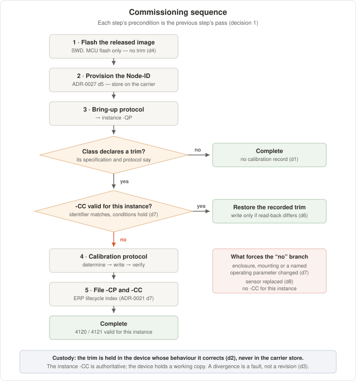

<!--
SPDX-FileCopyrightText: 2026 The IndustryGrow contributors
SPDX-License-Identifier: CC-BY-SA-4.0
-->

# ADR-0028: Commissioning sequence and calibration-trim custody

- **ID:** ADR-0028
- **Status:** Accepted
- **Date:** 2026-08-28
- **Project:** IndustryGrow
- **Parent:** ADR-0017 (rev 2)
- **Companions:** ADR-0007 (rev 1), ADR-0014 (rev 6), ADR-0021, ADR-0027
- **Realizes:** ADR-0027's deferred *"the provisioning tool"* and *"where the assignment is recorded against the instance"*

## Context and problem

ADR-0027 fixes Node-ID storage and the provisioning write, and defers the tool and the instance
record. The M01 U3 temperature offset is the first calibration trim in the project (M01
specification §10, O-45); `store/E0002-000001-M-calibration-protocol.md` fixes its determination,
its verification and the `-CP` / `-CC` records it produces.

No document fixes:

- the order of flashing, Node-ID provisioning, bring-up, calibration and record filing;
- which store holds a trim;
- the effect on a trim of a reflash, a module swap or a sensor replacement;
- when a recorded trim may be applied without re-determination.

Three device properties bound the answer.

| # | Property | Source |
|---|---|---|
| P1 | A trim is measurable only on an assembled board, running, at thermal equilibrium in its operating mode | Calibration protocol §4, §5 |
| P2 | The SCD41 applies its stored offset internally and derives RH from the corrected temperature | SCD4x datasheet |
| P3 | The offset EEPROM is rated for at least 2000 write cycles | SCD4x datasheet |

P1 excludes any sequence that supplies a trim before the assembled board exists. P2 excludes
correction downstream of the device: a temperature offset propagates into RH by a path a consumer
cannot invert. P3 bounds write frequency.

## Decision drivers

- A trim describes the module. The ADR-0027 store describes the carrier (decision 3).
- Re-determination costs ≥ 12 h in an uncontrolled ambient and ≥ 1 h in a held one (calibration
  protocol §5).
- Two unprovisioned nodes collide at `127` (ADR-0027 decision 6).
- Instance data belongs to the ERP; the repository holds procedures (ADR-0017, *Registry and store
  location*; ADR-0021 decision 7).
- Subjects 4120 and 4121 are invalid until a trim is in force (M01 specification O-45).

## Decision

1. **Commissioning is an ordered sequence. Each step's precondition is the previous step's pass.**

    | # | Step | Artefact |
    |---|---|---|
    | 1 | Flash the released image over SWD | — |
    | 2 | Provision the Node-ID | ADR-0027 decision 5 |
    | 3 | Execute the bring-up protocol | instance `-QP` |
    | 4 | Execute the calibration protocol, once per trim the class declares | instance `-CP`, `-CC` |
    | 5 | File the records | ERP (ADR-0021 decision 7) |

    Steps 4 and 5 are omitted for a class that declares no trim.

    

2. **A trim is held in the device whose behaviour it corrects.** The M01 U3 offset is held in the
   SCD41's EEPROM, not in the ADR-0027 carrier store. That store follows the carrier: a module
   moved between carriers would leave its trim behind, and a module fitted to a carrier holding
   another module's trim would be corrected by a value measured on a different board.

3. **The authoritative record of a trim is the instance `-CC`** (ADR-0017 decision 11). The device
   holds a working copy. Where the two differ, the `-CC` governs and the difference is a fault,
   not a revision.

4. **No trim is written at flash time.** Flashing writes MCU flash. Trims are written over the bus,
   by command, on a running node.

5. **A device with no trim operates at its factory default and reports it.** Firmware does not
   write a default back. The boot log distinguishes the factory default from any other value and
   does not assert which run produced a value.

6. **A trim is written only when the device read-back differs from the intended value** by more
   than the device's quantisation. This bounds consumption of the P3 budget.

7. **A recorded trim may be applied without re-determination only if the instance identifier
   matches and every validity condition named in its `-CC` still holds.** Enclosure, mounting and
   any operating parameter the `-CC` names are validity conditions. A change to one voids the
   `-CC`; the trim is then re-determined, not restored.

    ADR-0017 decision 11 anticipates a validity *period*, which suits a probe that drifts on a
    schedule. A fixed offset does not drift on a schedule; it is voided by a change to the
    conditions it was measured under. A `-CC` may therefore state a period, a set of conditions,
    or both, and is void when either is exceeded.

8. **Sensor replacement voids the trim.** The replacement holds its factory default and was not
   the part measured, so decision 7's conditions cannot be met.

9. **The commissioning tool is an operator tool.** It sequences decisions 1–7 and refuses a
   restore whose conditions fail. It does not allocate identifiers (ADR-0027 decision 7) and does
   not determine trims.

## Alternatives considered

**A. Hold trims in the ADR-0027 carrier flash store.** *Rejected:* lifecycle mismatch. That store
follows the carrier by its decision 3; a trim describes the module. The failure mode is silent —
a swapped module is corrected by another board's value rather than reporting no trim.

**B. Supply the trim at flash time from a build-time table.** *Rejected:* P1. The value does not
exist before the board is assembled and at equilibrium. It also spends a write cycle per flash,
against decision 6.

**C. Hold the trim only in the ERP and apply it at each boot.** *Rejected:* it makes published
values depend on gateway reachability at boot, and by P2 the device applies its stored offset
regardless, so the device holds a copy in any case.

**D. Correct downstream, in the gateway.** *Rejected:* P2. Correction upstream of the device's own
RH derivation is the only correction that reaches both quantities.

**E. Re-determine at every commissioning, with no restore path.** *Rejected:* it charges a full
determination to a routine reflash, and the `-CC` already carries the conditions under which a
value remains valid.

## Consequences

### Positive

- Commissioning has a fixed order; the tool implements it rather than defining it.
- A trim cannot be applied to a module it was not measured on.
- Flashing and Node-ID provisioning remain independent of trims.
- O-45's validity statement gains a mechanism: 4120 and 4121 become valid for an instance when its
  `-CC` is filed, and for that instance only.

### Negative

- Trim custody is split between the device and the ERP. Detecting divergence is new work, and
  decision 3 does not fix where it runs.
- Sensor replacement costs a re-determination.
- The tool requires ERP read access at commissioning.
- A class that declares a trim cannot be commissioned by flashing alone.

## Deferred decisions

- **The tool's interface and transport.** An operational specification, as ADR-0027 left it.
- **Trim types beyond the M01 U3 offset.** Each is declared by its class specification and its
  calibration protocol.
- **Where a device-versus-record divergence is detected and reported.** Candidates are the node's
  diagnostic channel and the gateway.
- ~~**Interaction with the firmware update path.**~~ — discharged 2026-08-29 by ADR-0029:
  ADR-0027 decision 4 is a named constraint there (property P3), and decision 1's partition
  table puts sector 11 outside both application slots.

## References

- ADR-0007 (rev 1): PKI and secure element identity — the ATECC608's scope.
- ADR-0014 (rev 6): Sensor node taxonomy — the class ID and its transports.
- ADR-0017 (rev 2): Component, document and instance identification — decision 11 fixes `-CP` and
  `-CC`; the *Registry and store location* section keeps instance data out of the repository.
- ADR-0021: Instance and integration ERP — decision 7 fixes the lifecycle-document index.
- ADR-0027: Node identity model — decisions 3, 4, 5, 6 and 7, and the deferred items this ADR
  realizes.
- `store/E0002-000001-M-calibration-protocol.md`: the M01 U3 offset procedure and its records.
- `spec/M01-CLIMATE-specification.md`: §10 and O-45.
