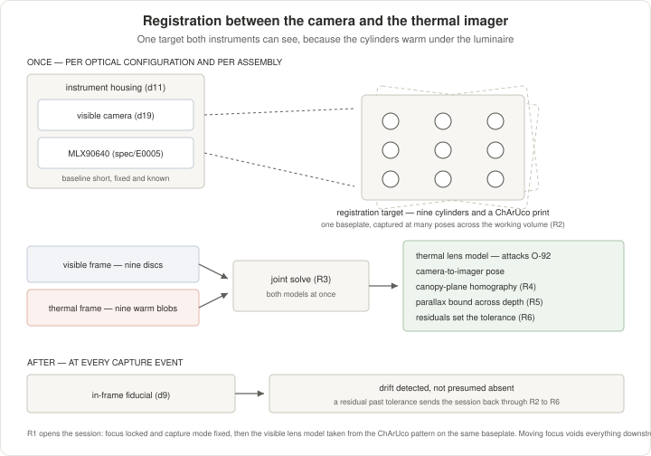

<!--
SPDX-FileCopyrightText: 2026 The IndustryGrow contributors
SPDX-License-Identifier: CC-BY-SA-4.0
-->

# ADR-0033: Canopy imaging channel

- **ID:** ADR-0033
- **Status:** Proposed
- **Date:** 2026-09-08
- **Project:** IndustryGrow
- **Parent:** ADR-0001
- **Companions:** ADR-0003, ADR-0014 (rev 7), ADR-0015, ADR-0016 (rev 1), ADR-0031 (rev 1), ADR-0032
- **Amends:** ADR-0020 decision 4 (survey-storage volume premise)

## Context and problem

A visible-light camera observes the growing volume as a gateway-attached instrument, housed with
the M04-PLANT thermal imager. It is not another sensor of the environment. Every module class in
ADR-0014 decision 4 and every actuator class in ADR-0031 decision 2 observes or drives the input
side or the apparatus; this instrument observes the response side, the plant.

Four facts in the corpus motivate the record:

| Fact | Where it stands today |
|---|---|
| The camera is routed to the gateway | `spec/E0005-R-specification.md` §3.2 says "Gateway; not a Cyphal node (ADR-0014 d9)"; no gateway-side record accepts it, and this is the corpus's only mention of a camera |
| No canopy segmentation exists | `O-88`: §6.4's statistics are frame-wide, which sets the meaning of every statistic, leaf VPD and hotspot reading, and has no path to closure without a segmentation source |
| Leaf area is measured nowhere | ADR-0016's third decision driver names changing leaf area index as a cause of model drift, so growth is absorbed into estimator residuals rather than observed |
| `A02-LIGHT` is unspecified | ADR-0031 d2 gives the class a medium, no specification and no class ID. A requirement on the luminaire is free to place now and expensive later |

This record fixes the **capture contract** and not the analysis method. The two differ in
reversibility: an analysis method can be chosen later from data that already exists, but capture
fidelity that was never recorded cannot be recovered.

Fixed elsewhere, not restated here:

| Concern | Owner |
|---|---|
| The camera is outside the Cyphal taxonomy and belongs to the gateway layer | ADR-0014 d9 |
| Phase-dependent spectrum; DLI target at the canopy | ADR-0003 d11, d12; band set in `profiles/` |
| The signed profile is the only channel that changes deployment behaviour | ADR-0015 d1 |
| Estimated publications are first-class and distinguishable from measured | ADR-0016 d5 |
| Store purposes, best-effort semantics, survey-capture mode | ADR-0020 d2, d3, d4 |
| Actuator command form, dead band, dwell at zero, validity deadline | ADR-0031 d4, d5 |
| Enclosure envelope: canopy ≤ 1 m², volume ≤ 3 m³, day load ≤ 150 W | ADR-0032 d1 |
| M04's radiometric behaviour, geometry, thermal and optical requirements | `spec/E0005-R-specification.md` §6, §8, §9 |
| E- and SP-numbers are assigned at design or selection commit, never reserved | ADR-0017 d5; ADR-0019 d6 |

## Decision drivers

- Nothing in the corpus observes the response side. Every existing class observes an input or
  the apparatus that produces it.
- `O-88` has no path to closure without a segmentation source, and it bounds the meaning of every
  M04 statistic rather than only its accuracy.
- Leaf area is unobserved, so a known drift term sits in the residuals ADR-0016 d7 monitors,
  where it is indistinguishable from an equipment fault.
- Discarded capture fidelity is unrecoverable; an analysis method is not. The contract is the
  half that cannot be deferred.
- A camera's own signal processing compensates away the quantity being measured. "No automatic
  correction" is therefore a configuration property that must be written down, not a property the
  hardware supplies.
- `A02-LIGHT` has no specification, so a capture-state requirement on the luminaire costs nothing
  today and costs a redesign once that specification is committed.
- The cultivation luminaire is the only light source in the volume, so the illuminant is a
  profile-controlled experimental factor unless the capture event takes it out of the recipe.

## Decision

1. **This record owns the visible-light imaging channel.** It is the gateway-side owner that
   ADR-0014 d9 and `spec/E0005-R-specification.md` §3.2 route to and that did not exist. The
   camera is an instrument, not a node: no module class, no module-ID strap, no carrier header
   signal, no Cyphal subject of its own.

2. **A capture is an instrument event, not a snapshot.** One event is an atomic sequence at a
   fixed clock phase:

   | Step | Luminaire state | Frame |
   |---|---|---|
   | 1 | as the recipe left it | M04 thermal frame |
   | 2 | all channels off | dark frame |
   | 3…n | one channel energised, the rest off | one exposure per channel |

   All frames of one event share one pose, one optical configuration and one mask. Exposure and
   gain are fixed per band and recorded with the frame. The thermal frame leads so that
   `spec/E0005` T3's settling requirement is met against the conditions the previous event left,
   not against the switching the present event is about to perform.

3. **The luminaire is driven to a fixed capture state, independent of the active recipe.** This,
   not darkness, is what keeps the illuminant out of the experimental factor: under ADR-0003 d11
   the spectrum is phase-dependent by design, so a capture taken under the recipe in force would
   vary with the very variable the channel exists to correlate against. The recipe is restored at
   the end of the event.

4. **Capture events are scheduled inside the photoperiod.** Firing the luminaire during the dark
   period is a photoperiodic intervention. It is tolerable for a day-neutral cultivar by
   definition of the cultivar (ADR-0003), which is exactly why it cannot be a platform default.
   The perturbation of the delivered light integral is bounded by event duration times event
   count, and is accounted against the ADR-0003 d12 target rather than ignored. What is decided
   is that it is accounted; the figures are profile and implementation values (ADR-0000 d2).

5. **No image signal processing in the measurement path.** Raw sensor data; no demosaic;
   automatic exposure, gain, white balance, high-dynamic-range merge and lens-shading correction
   off or bypassed. Statistics are computed per colour plane. Each of those operations is a
   scene-dependent correction that moves in the same direction as the quantity being measured, so
   leaving one enabled removes the signal and leaves a plausible image.

6. **An in-frame reference surface, in the canopy plane, in every frame.** Every event is
   normalised against a diffuse surface of stable reflectance. It sits in the canopy plane
   because illumination arrives from a fixed luminaire above, and a reference at a different
   height is not lit like the subject it normalises. The correction target is degradation of the
   luminaire and of the optical path across a cultivation cycle, which a calibration performed
   once at installation cannot observe.

7. **M02-LIGHT's reading at the capture instant is recorded with the event.** The reference
   surface returns the total gain of the illumination-and-optical path; M02 returns the spectral
   composition at the canopy (ADR-0014 d4). These are different quantities and neither
   substitutes for the other. This adds no sensor: M02 already publishes.

8. **Flat field per optical configuration; dark frame per event; scene illumination
   non-uniformity characterised separately.** A lens flat field corrects the optical path only.
   The luminaire is not coaxial with the camera, so illumination across the canopy is non-uniform
   in its own right. Because the luminaire is fixed, that non-uniformity is stable and is
   characterised once per installation rather than per event.

9. **Pose and optical configuration are fixed and monitored, not assumed stable.** Fiducials are
   in frame and pose drift is detected rather than presumed absent. Mechanical settings are
   locked; settings that are software-side are fixed by configuration and recorded with the
   frame.

10. **Segmentation is part of the measurement chain and is therefore versioned.** The mask method
    and its version are recorded with every derived value, and values carrying different mask
    versions are not comparable. The mask is computed from the white-channel frame of an event
    and applied to every frame of that event: geometry does not change within an event, and a
    mask derived under a single narrowband channel is not defined. Raw frames are retained so
    that re-segmentation is possible, which is why retention is a decision here and not an
    implementation detail.

11. **The camera and the M04 imager share a housing, on separate boards.** At the 0.3…0.6 m
    working distance of `spec/E0005` §6.6 one thermal pixel subtends 27 × 19 mm of scene at
    0.3 m and more further out, so a mounting tolerance of half a millimetre is a small fraction
    of a pixel and board-level co-location buys no registration accuracy that can be observed.
    What bounds overlay accuracy is parallax between two apertures against canopy depth
    variation, which the housing controls by keeping the baseline short and known.

    The housing shall provide a short, known and fixed baseline between the two apertures; a
    thermal break between camera and imager; two separate optical windows, since the imager needs
    a long-wave-infrared-transmissive path (`spec/E0005` M2, `O-96`) and the camera one passing
    decision 18's whole band set;
    and no encroachment on the obstacle-free cone of `spec/E0005` §9 M1. It is a designed
    assembly, so it takes an E-number at design commit and not here (ADR-0017 d5). It is the
    project's first assembly whose discipline is mechanical: every `REGISTRY.md` E-number entry
    is electrical today, and the enclosures that exist are `-D-case` document layers on an
    electrical E-number rather than assemblies of their own.

12. **The mask registers onto the M04 thermal frame.** The fixed baseline of decision 11 makes
    registration a property of the assembly rather than of an installation; the homography is
    established at commissioning and verified against the fiducials of decision 9. This is the
    intended path to `O-88`. It does not change M04's radiometric accuracy, which the device
    bounds (`spec/E0005` §6.3, `O-87`, `O-89`); it changes which pixels enter a statistic, and
    therefore what the statistic means. Leaf VPD stays deferred — this record supplies one
    missing input, not the pipeline ADR-0014 d4 defers.

    **Registration is established against a target both instruments can see.** A printed pattern
    is invisible to the imager, since black and white ink differ in emissivity by almost nothing.
    A target carrying raised cylinders solves it: they absorb the luminaire's light and rise
    above air temperature, so they read as warm blobs to the imager and as discs to the camera,
    and the same nine features carry both correspondences. The cylinders stand on one baseplate,
    so their spacings come from that part's own drawing rather than from a measurement in the
    cabinet, and their height makes the parallax of decision 11 measurable instead of asserted.

    

    | ID | Step | Yields |
    |---|---|---|
    | R1 | Lock focus and fix the capture mode, then take the visible lens model from a chessboard target | Camera intrinsics and distortion |
    | R2 | Capture pairs of the cylinder target at many poses across the working volume, luminaire on and settled | Correspondences visible in both instruments |
    | R3 | Solve the imager's lens model and the camera-to-imager pose together | Both models, from one session |
    | R4 | Project onto the canopy plane | The homography this decision uses |
    | R5 | Sweep the target through the depth range | The parallax bound of decision 11 |
    | R6 | Take residuals over the nine features | The registration tolerance (`O-120`) |

    R3 is the step that earns the session. `spec/E0005` `O-92` records that the imager has no
    per-pixel angular map and no distortion figure at all, so the imager is the binding term in
    this error budget; the same captures that fix the pose also estimate the model that item is
    missing. R1 is a precondition and not part of the session: intrinsics move with focus
    position, so a lens that refocuses voids every step below it.

    The session is run once per optical configuration and per assembly. It is not run again on a
    schedule, because decision 9's in-frame fiducial reports drift continuously and a residual
    past R6's tolerance is what calls for a repeat.

13. **The capture schedule is a profile field.** A capture event changes luminaire state for a
    measurement purpose. Carrying the schedule in the signed profile keeps ADR-0015 d1 intact
    rather than opening a second channel that changes deployment behaviour.

14. **A requirement is placed on `A02-LIGHT`.** Its future specification shall provide per-channel
    addressing, a defined capture state reachable independently of the active recipe, and
    restoration of the recipe afterwards, with a sequence duration short enough that decision 4's
    accounting stays negligible. This is a requirement on an unwritten specification, not a design
    of it, and it does not amend ADR-0031.

15. **Raw imagery is a distinct storage purpose under ADR-0020, time-boxed to survey campaigns.**
    Its volume is not modest, which is where ADR-0020 d4's premise is amended: that decision
    scopes survey capture on the premise that features rather than raw frames are stored. Only
    the volume premise changes. The store stays best-effort (ADR-0020 d3) — imagery does not
    become a durability guarantee. The retention bound is by campaign, not by capacity; the bound
    and the export path are implementation values (ADR-0000 d2). `spec/E0005` `O-97` already
    raises the same premise for M04's own frame archive against ADR-0020 d2.

16. **Everything derived from imagery is published as estimated, never as measured** (ADR-0016
    d5). A quantity fitted against a sensor's readings is not an independent measurement of that
    quantity, and the distinction survives into the data model rather than being settled by the
    quality of the fit.

17. **Lifecycle placement is not decided here.** The channel is survey-phase instrumentation today
    (ADR-0016 d1). Whether it belongs in the operating-phase minimum set is an output of the
    identification phase (ADR-0016 d2), not an authorial choice. The shared housing of decision 11
    does not bind the two instruments to one lifecycle, which is part of why they are separate
    boards.

18. **The optical path passes the luminaire's whole band set, and carries no infrared-cut
    filter.** The band set runs from the 365 to 385 nm ultraviolet-A channel to the 730 nm
    far-red one. A standard infrared-cut filter passes roughly 400 to 650 nm: it removes the
    far-red channel outright and clips the ultraviolet one. Silicon responds across the whole
    span, so the filter is the only thing in the way and removing it costs nothing but the
    filter.

    The requirement is on the **path**, not on the detector. Sensor cover glass, lens coatings
    and the housing window of decision 11 each carry a cut of their own, and a part that
    satisfies this at the sensor can still fail it at the lens. A candidate is qualified against
    the path it will actually sit in.

    This is what makes decision 3's sequencing load-bearing rather than merely preferable. With
    no cut filter, far-red and ultraviolet reach the detector during every exposure, so the only
    thing separating one band from another is that exactly one luminaire channel is energised.
    Alternative J records the rejection; this decision records the requirement that rejection
    implies, so that a part can be qualified against a decision rather than against the absence
    of an alternative.

19. **The detector is a colour sensor, and the ordinary colour image is a derived product of the
    white-channel frame.** Decision 3 puts the spectral selectivity in the illuminant, which on
    its own favours a monochrome detector: a colour filter array separates bands the sequencing
    has already separated, and spends resolution and sensitivity doing it. The luminaire settles
    it the other way. Its channels are warm white, red, far-red and ultraviolet-A, with no green
    and no blue, so a monochrome detector under this luminaire cannot reconstruct colour by any
    sequence. A colour detector yields it from the white channel directly.

    Colour is required and not merely convenient. Recognition of disease and disorder, human
    review of a flagged residual (ADR-0016 d7), and the body of pretrained vision models all
    work on ordinary colour images. The narrowband bands serve the pre-symptomatic ambition; the
    ordinary image serves what is already visible, which is the larger part of what an operator
    acts on.

    It costs nothing in the capture event. Decision 2's sequence already takes a white-only
    exposure, and that frame is the ordinary photograph. The viewable image is a **derived
    product** of it and not a second capture: demosaiced, and colour-rendered by a fixed
    transform computed once against the reference surface of decision 6. Decision 5 forbids
    scene-dependent correction in the *measurement* path; a constant transform under a fixed
    illuminant is neither scene-dependent nor in that path, and the raw planes stay the
    measurement. The viewable image carries no quantity, so decision 16 governs values derived
    from the frames rather than the rendering itself.

    Capturing at the fixed state of decision 3 rather than under the active recipe also makes
    the canopy look the same on day 5 and on day 60, which photography under a phase-dependent
    horticultural spectrum does not.

## Non-goals

- **No environmental sensor is replaced or made redundant.** Not claimed and not tested here. The
  camera sits on the response side of a lagged, nonlinear, many-to-one mapping: a correlation with
  an environmental variable would show that the plant responds to it, not that the sensor
  measuring it is surplus. Such a claim also requires the sensor present and trusted throughout
  the validation, so it cannot pay for itself before at least one full identification cycle.
- **No dedicated imaging illuminator.** The cultivation luminaire is the only source and the band
  set is bounded by `A02-LIGHT`. Against the profile instance's warm white, 660 nm red, 730 nm
  far-red and 365–385 nm UV-A, that yields a far-red channel on the rising limb of the red edge
  and no true near-infrared band; vegetation indices that require one are out of reach without
  reopening this non-goal.
- **No analysis method is chosen** — colour indices, spectral transforms, learned encoders. The
  contract exists so that the choice stays open.
- **No phenotypic or physiological claim** is made or implied.
- **No part or assembly number is allocated.** A purchased camera takes an SP number at selection
  commit (ADR-0019 d6); the housing takes an E-number at design commit (ADR-0017 d5). Neither is
  pre-reserved and `REGISTRY.md` is not touched.
- **`E0005` is not changed electrically.** Its schematic, layout and BOM are untouched; only the
  §3.2 ownership row and the `O-88` note change.
- **M04's radiometric accuracy is unchanged.** `O-87`, `O-89`, `O-91` and `O-92` are untouched.
- **No cultivation-run entity is defined.** Comparability across runs rests on one and the corpus
  has none; that gap is not this record's to close. Decision 10 versions the mask, nothing more.

## Alternatives considered

**A. The camera as a Cyphal node.** *Rejected:* ADR-0014 d9 already places it outside the
taxonomy, and the payload is incommensurate with classic CAN at 500 kbit/s (ADR-0002 rev 3).

**B. The camera on the `E0005` PCB.** *Rejected:* one thermal pixel subtends 27 × 19 mm at 0.3 m
(`spec/E0005` §6.6), so board-level placement improves registration by a fraction of a pixel that
cannot be observed, while parallax against canopy depth — which the housing baseline already
controls — is what bounds overlay accuracy. Against that non-benefit: `spec/E0005` T2 forbids a
further heat source on the module and T3 calibrates the device for settled conditions, while a
capture event is periodic and synchronous with the measurement; the ADR-0014 d5 header contract
carries no CSI link and d8's presence probe would not see the camera; the board becomes an `E0005`
populate variant (ADR-0017 d4) driven by a non-Cyphal concern; and two parts with different
obsolescence horizons and lifecycle status bind to one design revision.

**C. Two independently mounted instruments, no shared housing.** *Rejected:* the baseline becomes
an installation property rather than an assembly property, so registration must be re-established
per installation and re-verified after any service on either mount.

**D. Capture under the spectrum the active recipe commands.** *Rejected:* ADR-0003 d11 makes the
spectrum phase-dependent, so the illuminant co-varies with a profile-controlled factor, and three
broad colour planes cannot invert a spectral change.

**E. Capture in the dark period.** *Rejected* per decision 4: firing the luminaire at night is a
photoperiodic intervention whose tolerability rests on a cultivar property, not on the
architecture.

**F. A dedicated imaging illuminator.** *Not adopted:* it decouples the band set from `A02-LIGHT`
and admits a true near-infrared band. This is the reopening path if the available channels prove
insufficient (`O-122`), at the cost of a second heat source in the housing and a second thing to
calibrate and to age.

**G. Compressed storage.** *Rejected:* chroma subsampling and lossy coding destroy the statistic
being measured, and re-segmentation becomes impossible.

**H. Derived features only, frames discarded.** *Rejected:* it freezes the segmentation method
permanently, since a superseded method cannot be re-run on data that no longer exists.

**I. Defer the channel until an analysis method is chosen.** *Rejected:* the method cannot be
chosen without data, and the contract is what produces data worth choosing a method from.

**J. A sensor with an infrared-cut filter.** *Rejected:* the far-red and UV-A channels of ADR-0003
d11 are the bands with the most contrast against foliage, and a cut filter removes the far-red
one. The rejection depends on decision 3's single-channel sequencing: without it every colour
plane takes a common far-red offset, and the cut filter becomes the better option. Decision 18
states the requirement this rejection implies.

**K. A directional note inside ADR-0016, in the manner of its decision 16.** *Rejected:* this
introduces a storage class, a requirement on an unwritten actuator specification, a mechanical
assembly and a commissioning step. That is more than a direction.

## Consequences

### Positive

- `O-88` acquires a path: a segmentation source exists and registers onto the thermal frame.
- Leaf area becomes observable, moving a known drift term out of the ADR-0016 d7 residuals and
  into the state.
- Whole-canopy visual failure modes gain coverage no scalar sensor provides, complementing the
  residual monitoring of ADR-0016 d7 rather than duplicating it.
- The crop-response line of `project/RESEARCH.md` gains a non-destructive observation channel
  alongside its destructive quality proxies.
- The `A02-LIGHT` requirement lands before that specification is written, when it is free.
- The reference surface of decision 6 sits in both fields of view and is a candidate input to
  `O-87`, where leaf emissivity and reflected apparent temperature are placeholders. Recorded as
  a possibility, not as a decision.

### Negative

- The growing enclosure acquires a stray-light expectation the ADR-0032 envelope does not carry
  and `spec/E0011-R-specification.md` does not specify (`O-118`). Decision 18 widens it past what
  the eye can check: a leak invisible to an inspector still lands in the far-red measurement.
- ADR-0020's storage-volume premise no longer covers every purpose, so the store's sizing argument
  holds per purpose rather than globally.
- Statistics derived from M04 acquire a versioned dependency on a mask produced outside M04. An
  unversioned mask change silently invalidates a series.
- Commissioning gains a registration step with a tolerance that does not yet exist (`O-120`,
  ADR-0028).
- The delivered light integral acquires a small recurring debit that must be accounted per
  decision 4.
- The project acquires its first mechanical assembly, and with it a design and release discipline
  it has not exercised.
- A capture event couples measurement to actuator state. Decision 13 routes that coupling through
  the profile; it does not remove it.

## Deferred decisions

- **Sub-second channel sequencing against the actuator command rules** (`O-117`) — whether
  decision 14's sequence is admissible under ADR-0031 d5's dead band, minimum dwell at zero and
  validity deadline. Those rules exist to protect actuators, not to serve measurements, and the
  interaction is unexamined.
- **Stray-light expectation on the growing enclosure** (`O-118`) — absent from ADR-0032 and from
  `spec/E0011-R-specification.md`, while a capture event assumes the luminaire is the only source.
- **The shared housing** (`O-119`) — window materials for the two optical paths, the thermal
  break, condensation handling in a volume that may condense (`spec/E0005` `O-90`), clearance of
  the `spec/E0005` §9 M1 cone, and whether the reference surface of decision 6 is part of the
  assembly or separate.
- **Registration tolerance** (`O-120`) — decision 12 fixes the procedure; what residual over
  R6's nine features is acceptable, and what an operator does when the fiducial exceeds it, are
  a commissioning step under ADR-0028 and are unset.
- **Characterisation of scene illumination non-uniformity** (`O-121`) — decision 8 requires it
  once per installation and fixes neither method nor interval.
- **Red-edge contrast without a true near-infrared band** (`O-122`) — whether the 730 nm far-red
  channel is sufficient, which decides whether alternative F reopens.
- **Retention bound and export path for raw frames** (`O-123`) — under the amended ADR-0020 d4,
  bounded by campaign rather than by capacity.

## References

- ADR-0000 (rev 2): Decision records and the single-source-of-truth discipline — d2, d3.
- ADR-0001 (rev 1): IndustryGrow — open-core cultivation platform built on IndustryFlow.
- ADR-0003: Strawberry day-neutral profile — d11 (phase-dependent spectrum), d12 (DLI target).
- ADR-0014 (rev 7): Sensor node taxonomy and module decomposition — d1, d4, d5, d8, d9.
- ADR-0015: Gateway profile caching and local control loops — d1, d18.
- ADR-0016 (rev 1): Empirical survey, state-space modeling, and sensor density management — d1,
  d2, d5, d7.
- ADR-0017 (rev 3): Component, document, and instance identification scheme — d4, d5.
- ADR-0019: Purchased-part (SP) identification — d6.
- ADR-0020: Gateway persistence model — d2, d3, d4, d12.
- ADR-0028: Commissioning sequence and calibration-trim custody.
- ADR-0031 (rev 1): Actuator node taxonomy — d2, d4, d5, d8.
- ADR-0032: Grow-box climate conditioning — d1 (enclosure envelope).
- `spec/E0005-R-specification.md` — §3.2, §6.3, §6.6, T2, T3, §9 M1, M2, and `O-87` to `O-97`.
- `project/RESEARCH.md` — L5, crop-response identification.
- [Creative Commons Attribution-ShareAlike 4.0](https://creativecommons.org/licenses/by-sa/4.0/)
