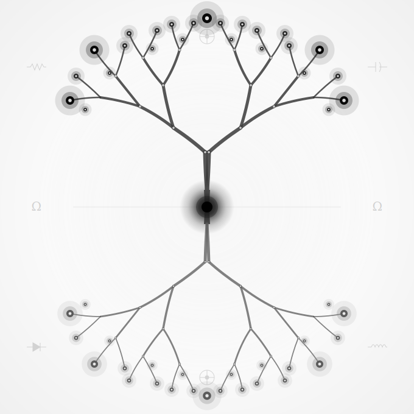

<!--
SPDX-FileCopyrightText: 2026 The IndustryGrow contributors
SPDX-License-Identifier: CC-BY-SA-4.0
-->

# IndustryGrow

**An open-core platform for instrumented, profile-driven crop cultivation that scales — on one architecture — from an apartment-sized cabinet to a several-hundred-square-metre commercial facility.**

<table>
<tr>
<td width="300">
  <picture>
    <source media="(prefers-color-scheme: dark)" srcset="img/industrygrow-logo-mono-dark.svg" />
    
  </picture>
</td>
<td>

## Purpose

IndustryGrow turns a growing space into a measured, controllable system. It provides the
field hardware, firmware, and edge software that sense a cultivation environment and run its
control loops. Its companion platform, **IndustryFlow**, stores history, runs analytics, and
distributes cultivation profiles.

The project is **open-core**: the same architecture serves community self-builders and
commercial managed deployments. Hardware designs and reference firmware are open; the
defensible value is not the sensors (commodity) but the expertise to *identify* a deployment's
dynamics and operate it efficiently afterward.
</td>
</tr>
</table>

## Core concept

- **One architecture, all scales.** Apartment cabinet and a 200 m² greenhouse use identical
  PCB designs, firmware, and data types. Scaling means *multiplying node instances across
  zones* — never introducing new node classes.
- **Profile as the single mutation channel.** A *cultivation profile* (signed, versioned JSON)
  is the only way to change how a deployment behaves. Human edits, ML-generated
  optimizations, and community contributions all flow through profile versioning — one audit
  trail, one rollback path.
- **Autonomous edge.** The gateway runs control loops *locally* against a cached profile.
  The cloud is an observer and profile source, never a real-time commander — plants keep
  growing through network outages.
- **Safety is hardware, separate from control.** The over-temperature interlock at the heating
  actuator cuts power independently of any software. The profile defines *operating* parameters;
  hardware defines *survival* parameters. The two never overlap.
- **Sensor density is temporal.** Dense coverage during an empirical *survey*, a reduced-order
  state-space model is *identified*, then most sensors return to inventory for the lean
  *operating* phase. Profiles carry the model alongside the setpoints.

## Technology

| Layer | Choice |
|-------|--------|
| Field bus | Cyphal application protocol over classic CAN @ 500 kbit/s, linear topology |
| Smart-node MCU | WeAct STM32F4 64-pin Core Board (STM32F405RGT6; F412/F446 drop-in) |
| Node carrier PCB | Custom integration board: CAN transceiver, ATECC608 secure element, sensor-module header |
| Gateway | Raspberry Pi (3B+ minimum, Pi 4/5 for higher traffic) + isolated 2-channel CAN HAT |
| Gateway software | Python / asyncio, SocketCAN + Pycyphal + Nunavut-generated DSDL bindings |
| Cloud link | mTLS to IndustryFlow; gateway is a **stateless edge** in steady state (audit trail on platform). Pre-cloud, and for buffering/survey, it keeps a bounded local store per ADR-0020 |
| Node firmware | Embedded C with libcanard |
| Identity & security | Per-node ATECC608 hardware identity; signed firmware; trusted in-cabinet CAN domain |

> Hardware design files live in `store/` under the ADR-0017 identification scheme
> (carrier = `E0001`, v0.0.1 → `E0001-000001.*`); see [`REGISTRY.md`](REGISTRY.md)
> for the E-number map. PCBs are authored in **KiCad 10** (will not open in
> earlier versions); cabinet distribution schematics (`.qet`, e.g. `E0007`) are
> drawn in **QElectroTech**.

### Sensor module catalog

Five reusable PCB designs, one functional subsystem each. Instances are specialized by
populated-BOM, not by new designs.

| Module | Subsystem | Key sensing |
|--------|-----------|-------------|
| M01-CLIMATE | Air environment | Temp/RH, gas/VOC, CO₂, airflow |
| M02-LIGHT | Photic environment | 11-channel spectral, UV-A |
| M03-ANALYTICS | Hydroponic solution | pH, EC, solution temperature |
| M04-PLANT | Plant-level | Canopy thermal imaging |
| M05-SAFETY | Power & monitoring | +12 V bus current, reported cabinet temp, door, leak (report/alert) |

## Project status

| Phase | Scope | State |
|-------|-------|-------|
| Phase 1 | Hardware + firmware bring-up; 5 sensor nodes + gateway; standalone, no cloud | In progress |
| Phase 2 | Cloud integration: mTLS ingestion, profile sync, audit trail | Blocked on IndustryFlow prerequisites |
| Phase 3 | Community profile registry, predictive ML, multi-cabinet coordination | Planned |

The dependency-ordered build sequence (14 stages, with the real cross-stage dependencies) lives in [`project/ROADMAP.md`](project/ROADMAP.md).

## Architecture decision records

ADRs are the source of truth for the design. Present in this repository:

- **ADR-0000** — Decision records and the single-source-of-truth discipline · *Accepted*
- **ADR-0001** (rev 1) — Project framing: open-core cultivation platform on IndustryFlow · *Accepted*
- **ADR-0002** (rev 3) — Field bus architecture · *Accepted*
- **ADR-0003** — Strawberry day-neutral cultivation profile (reference profile) · *Proposed*
- **ADR-0004** (rev 1) — Gateway host hardening & stateless-edge operation · *Accepted*
- **ADR-0005** (rev 1) — DSDL foundation: `industryflow.greenhouse` vocabulary, standard-type reuse, port-ID allocation · *Accepted*
- **ADR-0014** (rev 1) — Sensor node taxonomy and module decomposition · *Accepted*
- **ADR-0015** — Gateway profile caching and local control loops · *Accepted*
- **ADR-0016** (rev 1) — Empirical survey and state-space modeling · *Proposed*
- **ADR-0017** — Component, document, and instance identification scheme · *Accepted*
- **ADR-0018** (rev 1) — Cabinet-level power distribution and consumption metering · *Proposed*
- **ADR-0019** — Purchased-part (SP) identification · *Accepted*
- **ADR-0020** — Gateway persistence model (local store as lifecycle-dependent data sink) · *Proposed (draft)*

Status follows the lifecycle in **ADR-0000** (decision 7); the project maintainers are
the accepting authority.

Planned / not yet written: ADR-0006 (mechanical/hydroponic), ADR-0007 (PKI),
ADR-0008 (deployment topology), ADR-0009 (profile schema), ADR-0010 (commercial
operations), ADR-IF-0001 (IndustryFlow `production_unit`).

## Licensing

Open-core; license per part of the repo — see [`LICENSE.md`](LICENSE.md) for the
authoritative mapping, with full texts in [`LICENSES/`](LICENSES/).

- Hardware designs in `store/` (carrier + sensor modules): **CERN-OHL-S-2.0**
- ADRs & documentation (`ADR/`, `README`, `REGISTRY.md`): **CC-BY-SA-4.0**
- Reference firmware (`firmware/`, node sources): **AGPL-3.0-or-later**
- DSDL / protocol layer (`firmware/dsdl/`, the `industryflow.greenhouse.*` types): **Apache-2.0**
- WeAct core board snapshot retained under its upstream open-hardware license
