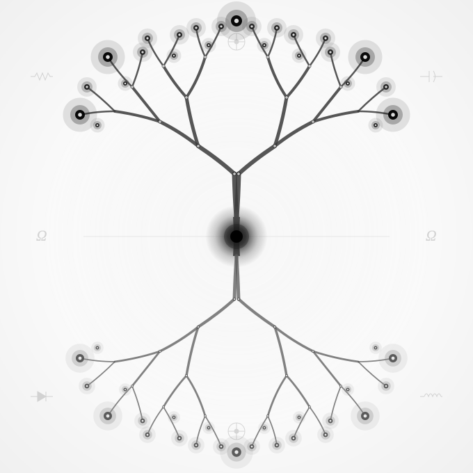

<!--
SPDX-FileCopyrightText: 2026 The IndustryGrow contributors
SPDX-License-Identifier: CC-BY-SA-4.0
-->

# IndustryGrow

**An open-core platform for instrumented, profile-driven crop cultivation that scales — on one architecture — from an apartment-sized cabinet to a several-hundred-square-metre commercial facility.**

> **Start here → [Motivation](MOTIVATION.md).** The gap this project is built to close, stated plainly.

<table>
<tr>
<td width="300">
  <picture>
    <source media="(prefers-color-scheme: dark)" srcset="img/industrygrow-logo-mono-dark.svg" />
    
  </picture>
</td>
<td>

## Purpose

IndustryGrow turns a growing space into a measured, controllable system: the field hardware,
firmware and edge software that sense a cultivation environment and run its control loops. Its
companion platform, **IndustryFlow**, stores history, runs analytics and distributes profiles.

**Open-core**, one architecture for self-builders and commercial deployments alike. Hardware
designs and reference firmware are open; the defensible value is not the sensors (commodity)
but the expertise to *identify* a deployment's dynamics and operate it efficiently.
</td>
</tr>
</table>

## Core concept

- **One architecture, all scales.** Cabinet and 200 m² greenhouse share PCB designs, firmware and
  data types. Scaling multiplies node *instances* across zones; it never adds node classes.
- **Profile as the single mutation channel.** A signed, versioned JSON *cultivation profile* is
  the only way to change how a deployment behaves — human edits, ML optimizations and community
  contributions all flow through it. One audit trail, one rollback path.
- **Autonomous edge.** The gateway runs control loops locally against a cached profile; the cloud
  observes and supplies profiles but never commands in real time. Plants keep growing through outages.
- **Safety is hardware.** The over-temperature interlock cuts power independently of software.
  Profiles define *operating* parameters, hardware defines *survival* parameters, never both.
- **Sensor density is temporal.** Dense coverage during an empirical *survey* identifies a
  reduced-order state-space model; most sensors then return to inventory for the lean *operating*
  phase. Profiles carry the model alongside the setpoints.

## Technology

| Layer | Choice |
|-------|--------|
| Field bus | Cyphal over classic CAN @ 500 kbit/s, linear topology |
| Smart-node MCU | WeAct STM32F4 64-pin core board (STM32F405RGT6; F412/F446 drop-in) |
| Node carrier PCB | Custom integration board: CAN transceiver, ATECC608 secure element, two-header sensor-module interface |
| Node firmware | Embedded C with libcanard — **one image**, node personality selected at runtime by the module-ID strap |
| Gateway | Raspberry Pi (3B+ minimum, 4/5 for higher traffic) + isolated 2-channel CAN HAT |
| Gateway software | Python / asyncio, SocketCAN + Pycyphal + Nunavut-generated DSDL bindings |
| Cloud link | mTLS to IndustryFlow; stateless edge in steady state, with a bounded local store for buffering and survey (ADR-0020) |
| Identity & security | Per-node ATECC608 hardware identity, operator CA, signed firmware and profiles |

> PCBs are authored in **KiCad 10** and will not open in earlier versions; cabinet distribution
> schematics (`E0007`) use **QElectroTech**. Design files live in `store/` under the ADR-0017
> scheme, packaged per document layer as `Exxxx-VVVVVV-S-src.zip` / `-D-src.zip` (d19) —
> [`CONTRIBUTING.md`](CONTRIBUTING.md) has the unpack/repack procedure.

## Sensor modules

Seven reusable PCB designs, one functional subsystem each. Instances are specialized by
populated BOM, never by new designs.

| Module | E-number | Subsystem | Key sensing | State |
|--------|----------|-----------|-------------|-------|
| M01-CLIMATE | `E0002` | Air environment | Temp/RH, gas/VOC, CO₂ | Laid out, PCBA ordered |
| M02-LIGHT | `E0003` | Photic environment | 14-channel spectral, UV-A/B/C | Laid out, DRC-clean |
| M03-ANALYTICS | `E0004` | Hydroponic solution | pH, EC, solution temperature | Blocked on ADR-0006 |
| M04-PLANT | `E0005` | Plant-level | Canopy thermal imaging | Blocked on bulk-transport decision |
| M05-SAFETY | `E0006` | Power & monitoring | +12 V bus current, cabinet temp, door, leak | **Fabricated, bench-verified** |
| M06-VENTILATION | `E0008` | Air transport | Duct velocity, filter Δp, envelope↔ambient Δp, in-stream T/RH | Specified, not laid out |
| M07-AMBIENT | `E0009` | Boundary conditions | Ambient T/RH, barometric, ambient CO₂, irradiance, wind | Specified, not laid out |

Plus the universal carrier `E0001` (v0.0.3, released) that every module mounts on, and the
cabinet distribution case `E0007`.

> M01 measures air *state* at the plant, M06 air *transport* through the cabinet — which is why
> airflow left M01 (ADR-0014 rev 2). M07's "ambient" is whatever the enclosure exchanges with one
> step out: the weather for a greenhouse, the room for a cabinet. It ships as indoor and outdoor
> variants of one design — same PCB, strap and firmware, different populated BOM and housing.

## Project status

| Phase | Scope | State |
|-------|-------|-------|
| Phase 1 | Hardware + firmware bring-up; M01–M05 + gateway; standalone, no cloud | In progress |
| Phase 2 | Cloud integration: mTLS ingestion, profile sync, audit trail | Blocked on IndustryFlow prerequisites |
| Phase 3 | Community profile registry, predictive ML, multi-cabinet coordination | Planned |

## Where things are

| Path | Contents |
|------|----------|
| [`MOTIVATION.md`](MOTIVATION.md) | **Why** — the gap IndustryGrow is built to close |
| [`ADR/`](ADR/) | **How** — architecture decision records, the source of truth, plus `GLOSSARY.md` |
| [`project/`](project/) | **When** — `ROADMAP.md` (14 dependency-ordered stages), `RESEARCH.md` (open directions L1–L7) |
| [`spec/`](spec/) | Module specifications: sensor complement, power, bus, thermal, mechanical |
| [`REGISTRY.md`](REGISTRY.md) | The E-number / SP-number identifier map |
| [`store/`](store/) | Hardware design and release artifacts, flat, keyed by identifier (ADR-0017) |
| [`firmware/`](firmware/) | Node firmware (C, libcanard) and the `industryflow.greenhouse` DSDL vocabulary |
| [`gateway/`](gateway/) | Gateway provisioning, hardening, identity, profile-pull client |
| [`erp/`](erp/) | Instance-and-integration ERP — the pre-cloud system of record (ADR-0021/0022) |
| [`pki/`](pki/), [`signing/`](signing/), [`profiles/`](profiles/) | Operator CA (ADR-0024), profile signing (ADR-0025), profile instances |
| [`CONTRIBUTING.md`](CONTRIBUTING.md) | Contribution licensing, DCO sign-off, working with the store |

## Architecture decision records

ADRs are the source of truth for the design. Status follows the lifecycle in ADR-0000 d7;
the project maintainers are the accepting authority.

| ADR | Subject | Status |
|-----|---------|--------|
| 0000 (rev 2) | Decision records and the single-source-of-truth discipline | Accepted |
| 0001 (rev 1) | Project framing: open-core cultivation platform on IndustryFlow | Accepted |
| 0002 (rev 3) | Field bus architecture — Cyphal/CAN, carrier PCB, stateless-edge gateway | Accepted |
| 0003 | Strawberry day-neutral cultivation profile (reference profile) | Proposed |
| 0004 (rev 1) | Gateway host hardening, firmware signing, stateless-edge operation | Accepted |
| 0005 (rev 1) | DSDL foundation — type vocabulary, standard-type reuse, port-ID allocation | Accepted |
| 0007 (rev 1) | PKI, hardware identity, and provisioning (ATECC608) | Accepted |
| 0014 (rev 5) | Sensor node taxonomy and module decomposition — M01–M07, 8-bit module ID | Accepted |
| 0015 | Gateway profile caching and local control loops | Accepted |
| 0016 (rev 1) | Empirical survey, state-space modeling, sensor density management | Proposed |
| 0017 (rev 2) | Component, document, and instance identification — d17/d18/d19 amendments | Accepted |
| 0018 (rev 1) | Cabinet-level power distribution and consumption metering | Proposed |
| 0019 | Purchased-part (SP) identification | Accepted |
| 0020 | Gateway persistence model — local store as lifecycle-dependent data sink | Accepted |
| 0021 (rev 3) | Instance-and-integration ERP: the pre-cloud system of record | Accepted |
| 0022 (rev 2) | Instance-and-integration ERP: the machine- and operator-facing API | Accepted |
| 0023 | The type registry as a machine-readable interface | Accepted |
| 0024 | Operator CA bootstrap and the root-key ceremony | Accepted |
| 0025 | Deployment-profile signing and gateway verification | Accepted |
| 0026 | ERP backup and restore across two stores | Accepted |
| 00XX | Environmental actuators — humidification and CO₂ enrichment | **Draft**, unnumbered |

Planned, not yet written: ADR-0006 (mechanical / hydroponic topology), ADR-0008 (deployment
topology), ADR-0009 (profile schema), ADR-0010 (commercial operations), ADR-IF-0001
(IndustryFlow `production_unit`). Numbers are assigned at commit, never pre-reserved.

## Licensing

Open-core, licensed per part of the repository. [`LICENSE.md`](LICENSE.md) is the authoritative
mapping; full texts are in [`LICENSES/`](LICENSES/).

| Part | Licence |
|------|---------|
| Hardware designs (`store/`) | `CERN-OHL-S-2.0` |
| Documentation (`ADR/`, `spec/`, `project/`, `README.md`, `REGISTRY.md`) | `CC-BY-SA-4.0` |
| Firmware, ERP, gateway clients, CA and signing tooling | `AGPL-3.0-or-later` |
| DSDL protocol layer (`firmware/dsdl/`) | `Apache-2.0` — permissive, so any implementation can speak it |

Third-party content keeps its own terms, annotated in [`REUSE.toml`](REUSE.toml): the WeAct
core-board snapshot and the SnapEDA CAD for the AS7331 are both published with **no licence
stated**, so neither is covered by this project's licences. Compliance is CI-enforced — run
`reuse lint` before opening a pull request.
