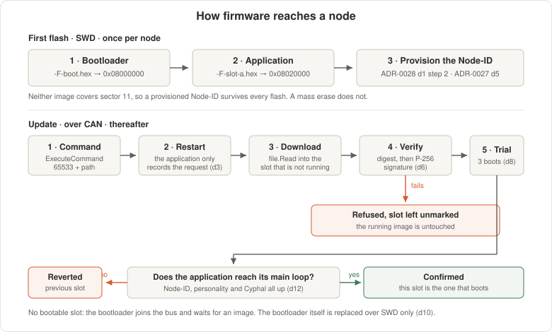

<!--
SPDX-FileCopyrightText: 2026 The IndustryGrow contributors
SPDX-License-Identifier: CC-BY-SA-4.0
-->

# IndustryGrow node firmware

Firmware for the IndustryGrow Cyphal/CAN sensor nodes. One codebase, one carrier (`E0001`), one
MCU (STM32F405RGT6 on a WeAct STM32F4 64-Pin Core Board, ADR-0002 rev 3). **One application
image** holds every module personality; the module-ID strap selects among them at boot
(ADR-0017 rev 2 d16). A node carries two components: a bootloader at the reset vector and that
application in one of two slots (ADR-0029 d1). Sources are `AGPL-3.0-or-later` (ADR-0002 d5); this document is
`CC-BY-SA-4.0`.

## State

| Item | State |
|---|---|
| M05-SAFETY (`E0006`) | Verified on hardware; seven subjects publish (4096–4102) |
| M01-CLIMATE (`E0002`) | Verified on hardware 2026-08-24; ten subjects publish (4112–4121) |
| Node-ID store (ADR-0027) | Built; verified on hardware 2026-08-28 |
| U3 temperature offset | Implemented as vendor command 3; applied per instance `-CC` (ADR-0028) |
| Boot chain (ADR-0029) | Verified on hardware 2026-08-29: hand-over, fallback, update-state write |
| Firmware download over CAN | Built — the bootloader is a Cyphal node and a `uavcan.file.Read` client |
| Image signing (ADR-0029 d6) | Built — needs a key given to the build; an unsigned image is refused |
| Subject-ID registers (ADR-0005 d7) | Not implemented — defaults are compiled in |
| SCD41 forced recalibration | Not implemented (M01 spec O-5) |

## What the firmware is

A Cyphal/CAN node. Application protocol and wire vocabulary are fixed elsewhere.

- **Bus** — classic CAN, 500 kbit/s, linear; Node-ID provisioned per instance (ADR-0002 d8,
  ADR-0005 d6, ADR-0027).
- **Vocabulary** — DSDL: the OpenCyphal standard `uavcan.*` set plus project
  `industryflow.greenhouse.*` types (ADR-0005). Physical quantities ride `uavcan.si.sample.*`;
  accumulated S0 energy is joule (ADR-0005 rev 1 d3); door and leak are minimal `safety` status
  types with no command field (M05 is sense-only, ADR-0018 d9).
- **Identity** — three values from three sources, none standing in for another (ADR-0027 d9).
  Module *class* from the ID straps at boot (ADR-0014 rev 6 d6, d8). Cyphal `unique_id` from the
  ATECC608 serial, STM32 factory UID as fallback (ADR-0027 d8). *Node-ID* from the flash store
  below. Role and zone are gateway-side tags, not firmware (ADR-0014 rev 6 d7).

## Toolchain

| Concern | Choice |
|---|---|
| Cyphal transport | [libcanard](https://github.com/OpenCyphal/libcanard) (MIT) |
| Allocator | [o1heap](https://github.com/pavel-kirienko/o1heap) (MIT) |
| DSDL → C | [Nunavut](https://github.com/OpenCyphal/nunavut), pinned via pip, run at build time; generated code not vendored (ADR-0005 d10) |
| Standard types | [public_regulated_data_types](https://github.com/OpenCyphal/public_regulated_data_types), pinned |
| MCU peripherals | CMSIS device headers + register-level init; no vendored HAL tree |
| Compiler / build | `arm-none-eabi-gcc` + CMake |
| Dependency vendoring | git submodules pinned to tags (`tools/bootstrap.sh`) |

## Layout

The **carrier `E0001` is the parent**: `common/carrier/` owns the bus, LEDs, MCU socket and node
identity shared by every node. A **node `nodes/<type>/` is a child**: it asserts a module-ID strap
pattern and adds its sensor personality. M02–M04 become sibling `nodes/`, each adding one line to
`nodes/registry.c`.

```
firmware/
├── README.md  CMakeLists.txt      ← three targets: igrowboot.elf, igrow-a.elf, igrow-b.elf
├── cmake/      arm-none-eabi.cmake (toolchain) · dsdl.cmake (Nunavut codegen)
├── ldscripts/  STM32F405RGTx_BOOT.ld · STM32F405RGTx_APP.ld.in (per-slot template)
├── boot/       main.c update.c verify.c
│                                   ← bootloader: A/B decision, slot check, hand-over;
│                                     the download, and P-256 verification before a
│                                     slot is marked bootable
├── common/                       ← runs identically whichever module is fitted
│   ├── node/       main.c node.h  ← boot → strap → personality dispatch; the seam
│   ├── carrier/    e0001.{h,c}    ← E0001 carrier: pins, LEDs, straps, ATECC608/identity
│   ├── platform/   clock.{h,c}    ← 168 MHz clock, SysTick, micros
│   │               partition.h image.{h,c} update_state.{h,c} crc32.{h,c}
│   │               sha256.{h,c}   ← the ADR-0029 flash map, shared by both images
│   ├── drivers/    can i2c uart   ← bxCAN, I2C1, debug UART (register-level)
│   └── cyphal/     cyphal registers ← Heartbeat/GetInfo/register/ExecuteCommand
├── nodes/
│   ├── registry.c                ← module-ID → personality table (the ONLY file
│   │                                that knows every node type)
│   ├── m05_safety/
│   │   ├── module_id.h (0x05)  sensors.{h,c}
│   │   └── drivers/  ina226 tmp117 s0 leak
│   └── m01_climate/
│       ├── module_id.h (0x01)  sensors.{h,c}
│       └── drivers/  sht4x bme68x scd4x · sensirion (shared CRC-8/word codec)
├── dsdl/industryflow/greenhouse/
│   ├── safety/    DoorStatus, LeakStatus
│   └── climate/   RelativeHumidity, Co2Concentration, GasResistance
├── third_party/                  ← submodules: libcanard, o1heap, cmsis, regulated types,
│                                     micro-ecc (BSD-2-Clause; P-256 verification)
└── tools/                        ← bootstrap.sh, release.sh, mkimage.py
```

Pin assignments are not repeated here; `store/E0001-000003-D-pinmap.md` is the BSP source of truth.

## Identity resolution

A strap value no personality claims is **unidentified**, never a guessed class (ADR-0014 rev 6 d6).
The node still brings up the Cyphal skeleton and enumerates as
`org.industrygrow.node.unidentified`, publishing no subjects.

`127` means one thing: no Node-ID provisioned (ADR-0027 d10). An unidentified but provisioned node
keeps its Node-ID and reports the unresolved personality through `GetInfo` and its health.
Publishing requires both a provisioned identity and a resolved personality.

### Provisioning a Node-ID

The store is the last flash sector (`0x080E0000`, sector 11), reserved by the linker script and
outside the application region. A record is magic, version, Node-ID and CRC; an absent or
interrupted record reads as unprovisioned.

| Step | Effect |
|---|---|
| Write `uavcan.node.id` = *n* (0–126) | Sector erased and rewritten. The register reads *n* while the transport still runs on the old value |
| Restart | *n* is adopted |
| Write `uavcan.node.id` = 127 | Store cleared; the node returns to unprovisioned |

An out-of-range value or a flash failure leaves the register reading what the store holds, which is
how a rejected write is visible. While a committed value differs from the running one, the node
repeats a `uavcan.diagnostic.Record` naming it (ADR-0027 d5).

**A flashing tool must not mass-erase.** Writing an image erases only the sectors it covers, and
the store is not one of them (ADR-0027 d4, ADR-0029 d1). A mass erase de-provisions every node it
touches.

The commit blocks for the sector erase — of the order of a second, interrupts masked. The erase
routine runs from RAM and reloads the watchdog itself, because the flash controller stalls every
flash read while it works; `millis()` loses that interval.

## Default subject-ID map

Compiled-in defaults in the unregulated range. M05 holds 4096–4102, tabled in
`store/E0006-000001-M-bringup-protocol.md`; M01 starts at 4112 so the M05 block can grow.

| ID | M01 subject | Source | Type |
|----|-------------|--------|------|
| 4112 | air temperature | U1 SHT45 | `uavcan.si.sample.temperature.Scalar` (K) |
| 4113 | air relative humidity | U1 SHT45 | `…climate.RelativeHumidity` (ratio) |
| 4114 | air VPD | derived from U1 | `uavcan.si.sample.pressure.Scalar` (Pa) |
| 4115 | CO₂ | U3 SCD41 | `…climate.Co2Concentration` (mole fraction) |
| 4116 | barometric pressure | U2 BME688 | `uavcan.si.sample.pressure.Scalar` (Pa) |
| 4117 | gas resistance (VOC trend) | U2 BME688 | `…climate.GasResistance` (Ω) |
| 4118 | secondary temperature | U2 BME688 | `uavcan.si.sample.temperature.Scalar` (K) |
| 4119 | secondary humidity | U2 BME688 | `…climate.RelativeHumidity` (ratio) |
| 4120 | secondary temperature | U3 SCD41 | `uavcan.si.sample.temperature.Scalar` (K) |
| 4121 | secondary humidity | U3 SCD41 | `…climate.RelativeHumidity` (ratio) |

Only 4112–4114 are admissible for VPD and the climate control loop. 4118–4121 are the secondary
sources of M01 spec §4; 4120 and 4121 are valid for an instance once its `-CC` is filed (O-45,
ADR-0028 d9).

## Build

`CMAKE_TOOLCHAIN_FILE` must be **absolute**, and the Ninja generator needs `CMAKE_MAKE_PROGRAM`
given explicitly — a relative toolchain path fails with *"Could not find toolchain file"*.

```sh
tools/bootstrap.sh                     # fetch and pin submodules; needs nnvg (Nunavut)

cmake -S firmware -B firmware/build -G Ninja \
      -DCMAKE_MAKE_PROGRAM="$(command -v ninja)" \
      -DCMAKE_TOOLCHAIN_FILE="$PWD/firmware/cmake/arm-none-eabi.cmake"
cmake --build firmware/build
```

Both settings are cached, so later configures may pass only `-DCMAKE_BUILD_TYPE=`. Release is much
smaller than Debug (~21 KB against ~66 KB). Linker warnings from `nosys.specs` (`_close is not
implemented`, `LOAD segment with RWX permissions`) are expected.

Output is three images. What a node becomes is decided by the module in the carrier socket, not by
which file was flashed; which slot an application image is for is a link address, not a variant.

| Artifact | Load address | Holds |
|---|---|---|
| `igrowboot.hex` | `0x08000000` | bootloader, sectors 0–3 |
| `igrow-a.hex` | `0x08020000` | image header + application, slot A |
| `igrow-b.hex` | `0x08080000` | image header + application, slot B |
| `igrow-<slot>.img` | — | the same bytes unaddressed: what a signature covers and what the gateway serves |

`tools/mkimage.py` writes the header (`common/platform/image.h`); the flash map it addresses is
ADR-0029 d1, stated in C by `common/platform/partition.h`.

### Signing keys

An image is accepted over the bus only if it carries a signature from the key the bootloader was
built with (ADR-0029 d6). Neither half of that key lives in this repository — custody is the key
ceremony's (ADR-0024) — so both are build inputs:

```sh
py tools/mkimage.py --new-key ~/igrow-signing-key.pem      # once, kept off the repo
py tools/mkimage.py --public-key ~/igrow-signing-key.pem   # prints 128 hex characters

cmake -S firmware -B firmware/build ... \
      -DIGROW_SIGNING_KEY="$HOME/igrow-signing-key.pem" \
      -DIGROW_VERIFY_KEY_HEX=<those 128 characters>
```

Without them the build still runs and the images still flash over SWD; they simply cannot be
accepted over the bus, because an unsigned image fails verification and a bootloader with no key
refuses every image. The build says so at configure time.

## Flashing and updating



SWD is on the WeAct debug header, reachable with the carrier mounted. CAN1 sits on PB8/PB9, off the
USB pins, so WeAct USB DFU stays available as a recovery path (pin-map note 5).

| | Command |
|---|---|
| First flash, 1 | `STM32_Programmer_CLI -c port=SWD mode=UR freq=950 -d E0001-VVVVVV-F-boot.hex -v` |
| First flash, 2 | `STM32_Programmer_CLI -c port=SWD mode=UR freq=950 -d E0001-VVVVVV-F-slot-a.hex -v` |
| Provision | `store/SP0004-M-gateway-bringup.md` §8 |
| Update | `uavcan.node.ExecuteCommand` 65533, artifact path in the parameter |

Whoever sends the command serves the file: the bootloader reads it back from that node with
`uavcan.file.Read` (subject 408). The target is always the slot that is not running.

| Blue LED (PB2) | Node is |
|---|---|
| dark | running the application |
| lit | in the bootloader, on the bus |
| flickering | downloading, one flicker per 256-byte block |
| steady through a pause | verifying |
| 2 Hz | holding no bootable image, waiting for one |

A failed download clears the request before erasing anything, so a node that cannot reach its file
server retries nothing and boots what it already had.

## Release artifacts (`store/`)

`tools/release.sh` builds the image and publishes it under the ADR-0017 rev 2 **`F` (Firmware)**
document layer (see `REGISTRY.md`):

```
store/E0001-000001-F-boot.hex    # bootloader
store/E0001-000001-F-slot-a.hex  # application, slot A
store/E0001-000001-F-slot-b.hex  # application, slot B
store/E0001-000001-F-src.zip     # source snapshot of firmware/ at HEAD
```

Filed under `E0001` — the carrier whose one codebase every node runs, so firmware identity follows
the carrier, not the module (ADR-0017 rev 2 d16). One `F` object per firmware version covers every
node type. Refreshed in place at the same `F` version while unverified against hardware; `F` bumps
on a released change. `firmware/build*/` stays git-ignored.

## References

- ADR-0002 rev 3 — field bus: Cyphal/CAN, MCU, carrier, 500 kbit/s.
- ADR-0005 rev 1 — DSDL foundation: vocabulary, joule energy, node skeleton, port-IDs.
- ADR-0014 rev 6 — sensor-node taxonomy: module straps, presence probing, gateway tagging.
- ADR-0007 rev 1 — PKI and hardware identity: the ATECC608 as identity anchor.
- ADR-0017 rev 2 — document layers; d16 roots firmware on the carrier.
- ADR-0029 — node firmware update and bootloader: the flash partition, A/B slots and image header.
- ADR-0018 — M05 sense-only; door/leak report-only; S0 energy.
- ADR-0027 — node identity model: the Node-ID store, its survival and `127`.
- ADR-0028 — commissioning sequence and trim custody.
- `spec/M01-CLIMATE-specification.md` — M01 sensor complement, VPD, CO₂ handling, §10.
- `spec/M05-SAFETY-specification.md` — the as-built form of that document class.
- `store/E0001-000003-D-pinmap.md` — carrier pin map, the BSP source of truth.
