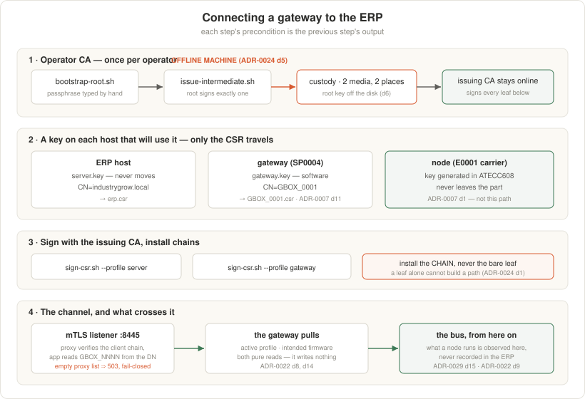

<!--
SPDX-FileCopyrightText: 2026 The IndustryGrow contributors
SPDX-License-Identifier: CC-BY-SA-4.0
-->

# Connecting a gateway to the ERP

The ordered procedure for giving a gateway an identity and pointing it at the ERP.
**ADR-0007** decides who the gateway is, **ADR-0024** decides the CA that says so,
and **ADR-0022** decides what the channel carries; this file is the runbook and
holds the values (ADR-0000 d2).



Each step's precondition is the previous step's output: a CSR cannot be signed
before a CA exists, and the gateway cannot pull before the channel verifies it.

## What the gateway's identity is

A node's key is generated inside its ATECC608 and never leaves the part
(ADR-0007 d1). **A gateway's is not**: the reference gateway is a stock
single-board computer bought as SP0004 and carries no secure element, so its key
is generated on the gateway and protected by the host (ADR-0007 rev 2 d11).

**Root on the gateway is the private key.** The host hardening of ADR-0004 is
therefore load-bearing for identity, not only for availability, and a stolen
gateway is a usable credential until its certificate expires or the issuing CA
revokes it.

---

## 1. The operator CA — once per operator

Run the ceremony in `pki/README.md`. It is not part of this procedure because it
is not per-gateway: every gateway and the ERP itself chain to the same root.

**It must run on a machine that is offline at generation time** (ADR-0024 d5), so
it cannot be scripted from a networked host. Generate the passphrase in 1Password
(`IndustryGrow/operator-ca`) *before* going offline and type it at the prompt —
`op run` resolves over the network and is for issuance only.

Output: `ca/operator-root.crt` (public, copy freely), `ca/issuing-ca.crt`, and the
issuing key that signs everything below. The root key goes to two removable media
and off the disk.

## 2. Keys and CSRs — one per host, generated where they live

Neither private key ever moves. Only the CSR travels, and a CSR is public.

```bash
# on the ERP host
umask 077
openssl ecparam -name prime256v1 -genkey -noout -out server.key
openssl req -new -key server.key -out erp.csr \
        -subj "/CN=industrygrow.local/O=OP-STRAWBERRY-01"

# on the gateway
sudo install -d -m 0750 -o root -g gateway /etc/industrygrow/pki
sudo sh -c 'umask 027; openssl ecparam -name prime256v1 -genkey -noout \
        -out /etc/industrygrow/pki/gateway.key'
sudo chgrp gateway /etc/industrygrow/pki/gateway.key
sudo openssl req -new -key /etc/industrygrow/pki/gateway.key \
        -out /etc/industrygrow/pki/gateway.csr \
        -subj "/CN=GBOX_0001/OU=gateways/O=OP-STRAWBERRY-01"
```

**Group `gateway`, not root-only.** Every unit that uses this identity runs as
`User=gateway` — the profile pull and the firmware timer both. A `0700` directory
or a `0600` key leaves them unable to read the certificate they authenticate
with, and the failure surfaces as a permission error on a path, nowhere near the
certificate ceremony that caused it. Run `provision.sh` before this step, so the
service user exists.

**The CN is the machine identifier verbatim.** `erp/app/services/mtls.py` derives
`GBOX_NNNN` from the certificate's subject DN, so a CN that is not an ADR-0017
machine identifier authenticates and is then refused. This convention is fixed
here and in `erp/deploy/mtls/`, not in an ADR.

## 3. Sign them

```bash
op run --env-file=pki/.env.op.tpl -- ./pki/sign-csr.sh \
  --dir ./ca --csr GBOX_0001.csr --profile gateway --pass env:IGROW_CA_PASS

op run --env-file=pki/.env.op.tpl -- ./pki/sign-csr.sh \
  --dir ./ca --csr erp.csr --profile server --pass env:IGROW_CA_PASS \
  --san 'DNS:industrygrow.local,IP:192.168.178.55' --out ./ca/server.crt
```

## 4. Install

The gateway needs three files in `/etc/industrygrow/pki/`:

| File | What it is |
|---|---|
| `gateway-chain.crt` | the gateway leaf **plus the issuing CA** |
| `gateway.key` | already there from step 2; never copied |
| `operator-root.crt` | the anchor the ERP's server certificate is checked against |

**Serve and present chains, not bare leaves.** With the two-tier CA (ADR-0024 d1)
a peer anchored on the root cannot build a path from a leaf alone. The symptom is
the *other* end failing to verify.

The ERP needs `server-chain.crt`, `server.key` and `operator-root.crt` in its
`ERP_TLS_DIR`; see `erp/deploy/README.md` §2.

## 5. Point the gateway at the ERP

`/etc/industrygrow/gateway.env`:

```sh
IGROW_ERP_URL=https://industrygrow.local:8445
IGROW_CAN_IFACE=can0
```

`8445` is the mTLS listener, not the console. The console port terminates TLS
without requiring a client certificate and answers gateway routes with 403 — a
gateway pointed at it authenticates as nobody.

## 6. Bring up the channel

```bash
cd erp
docker compose -p industrygrow-erp -f docker-compose.yml -f docker-compose.mtls.yml up -d
```

The overlay replaces the console-only overlay: it puts certificate verification in
front of the gateway routes and removes the app's published port. Set
`ERP_GATEWAY_TRUSTED_PROXIES` to the proxy's address as seen on the wire. Empty
is the default and is fail-closed: gateway routes answer 503, because a forwarded
header from an unidentified proxy is indistinguishable from a forged one
(ADR-0022 d2).

## 7. Verify, in this order

```bash
# the channel exists and rejects an unauthenticated caller
curl -sk https://industrygrow.local:8445/api/v1/gateway/firmware      # expect 401

# the gateway is accepted and gets its own machine's record
sudo -u gateway /opt/industrygrow/venv/bin/python /opt/industrygrow/firmware_client.py show

# what each node needs, changing nothing
sudo -u gateway /opt/industrygrow/venv/bin/python /opt/industrygrow/firmware_client.py once --dry-run

# the profile path, same channel
sudo -u gateway /opt/industrygrow/venv/bin/python /opt/industrygrow/profile_client.py once
```

`sudo -u gateway`, not `sudo`: the artifact cache and the profile directory are
owned by the service user, and a check run as root leaves files behind that the
unit then cannot write.

A `503` from any gateway route means the trusted-proxy list is empty. A `401`
means the certificate was not accepted — check that the *chain* is presented, not
the leaf.

## 8. Let it run

`provision.sh` installs `industrygrow-firmware.timer` and starts it when
`IGROW_ERP_URL` is set. From there the loop is unattended: an operator selects a
release for the machine in the console, and the next pass brings the nodes onto
it (ADR-0029 d16).

```bash
systemctl list-timers industrygrow-firmware.timer --no-pager
journalctl -u industrygrow-firmware.service -n 50 --no-pager
```

| Bound | Where it is set |
| --- | --- |
| every hour, 5 min after boot, ±5 min jitter | `industrygrow-firmware.timer` (`systemctl edit`) |
| one pass, 1 h | `industrygrow-firmware.service` `TimeoutStartSec` |
| one node's transfer, 420 s | `IGROW_FIRMWARE_TRANSFER_TIMEOUT_S` |

A pass ending `no firmware release intended for this machine` is a failed unit and
the correct state before anyone has selected one — nothing reaches a node until
they do. A node reported `unidentified` is running an image this gateway does not
hold, and is left alone until an operator resolves it by SWD or by making that
release available (ADR-0029 d17).

## What this does not give you

The ERP never learns what a node is running. `firmware_client.py once --dry-run`
is the only thing that answers it, because the answer is on the bus (ADR-0029 d15;
ADR-0022 d9). A console that showed "firmware up to date" would be inventing it.
