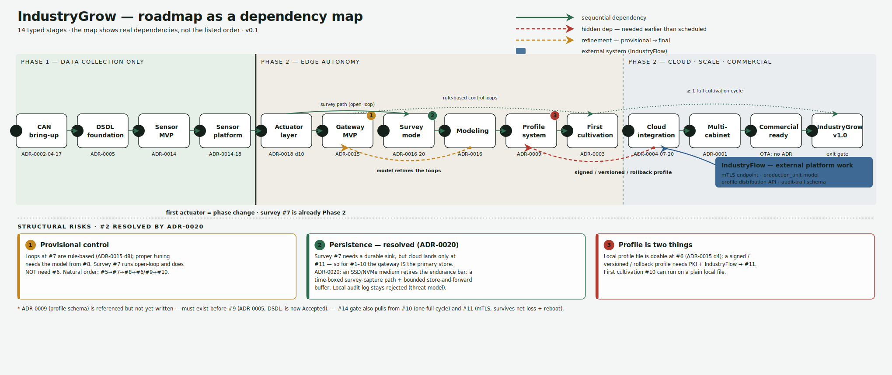

<!--
SPDX-FileCopyrightText: 2026 The IndustryGrow contributors
SPDX-License-Identifier: CC-BY-SA-4.0
-->

# IndustryGrow — implementation roadmap

- **Status:** Living document
- **Date:** 2026-06-15
- **Project:** IndustryGrow
- **Parent:** ADR-0001
- **Companions:** ADR-0002, ADR-0004, ADR-0014, ADR-0015, ADR-0016, ADR-0018, ADR-0020

## What this document is

This is the execution map for IndustryGrow: the order in which capabilities are
built and, more importantly, the dependencies between them. It complements the
ADRs without competing with them. The ADRs remain the single source of truth for
*decisions and rationale* (ADR-0000); this roadmap only **references** those
decisions and arranges them in build order. Where a stage rests on a decision,
the governing ADR is named — the roadmap does not restate the argument, the same
way the glossary and the ADRs do not restate each other.

The map below is the authoritative view. The stage table further down is a linear
reading of it for convenience, but the **dependency structure — not the
numbering — governs build order.**

> The figure is generated from `gen_roadmap.py` (in `figures/`); coordinates,
> labels, palette, and ADR tags live at the top of that script — edit there and
> regenerate, do not hand-edit the SVG. For a raster fallback, render the SVG with
> an SVG tool (e.g. `rsvg-convert` or Inkscape) into `figures/`.

## How to read the map

Solid green arrows are sequential dependencies: the stage at the tail must exist
before the stage at the head. Dashed red arcs are **hidden dependencies that run
backwards across the timeline** — a capability scheduled late that an earlier
stage actually needs; their backward direction is the warning. Dashed amber marks
a **refinement**, where a provisional artifact is later replaced by a final one.
The blue block is external platform work (IndustryFlow) that gates cloud
integration. The numbered discs flag the open risks listed below.

The bold vertical rule between stage 4 and stage 5 is the Phase 1 → Phase 2
boundary. **Phase 1 is data collection only — no actuators.** The first actuator
node (stage 5) is the phase change itself. Note that Survey mode (stage 7), though
it sits early in the scientific arc, is already Phase 2: its step-response
experiments require operator-controllable actuators.

## Stages and dependencies

| # | Stage | Depends on | Governing ADR(s) | Outcome |
|---|-------|------------|------------------|---------|
| 1 | CAN bring-up | — (root) | ADR-0002, ADR-0004, ADR-0017 | Nodes enumerate on the gateway console |
| 2 | DSDL foundation | 1 | ADR-0005 \* | Stable wire vocabulary for the whole system |
| 3 | Sensor MVP | 2 | ADR-0014 | Live telemetry from the first sensor node |
| 4 | Sensor platform | 3 | ADR-0014, ADR-0018 | Full cabinet telemetry (M01–M05) — **end of Phase 1** |
| 5 | Actuator layer | 4 | ADR-0018 (d10 interlock) | Environment can be driven; HW thermal cutoff + watchdog |
| 6 | Gateway MVP *(branch)* | 5 | ADR-0015 | Cabinet runs without cloud on rule-based loops (provisional) |
| 7 | Survey mode | 5 | ADR-0016, ADR-0020 | Dense, high-rate data for system identification |
| 8 | Modeling | 7 | ADR-0016 | First reduced-order state-space model (off-line) |
| 9 | Profile system | 8 (local) · 11 (signed) | ADR-0009 \*, ADR-0015 | Cultivation logic expressed as a profile |
| 10 | First cultivation | 9, 6 | ADR-0003 | One reference cycle (strawberry day-neutral) |
| 11 | Cloud integration | IndustryFlow (external) | ADR-0004, ADR-0007, ADR-0020 | Cloud becomes observer + profile source |
| 12 | Multi-cabinet | 11 | ADR-0001 | Scaling proven across cabinets |
| 13 | Commercial readiness | 11, 12 | — (OTA: no ADR yet) | OTA, remote diagnostics, inventory, recovery |
| 14 | IndustryGrow v1.0 | 10, 11, 13 | exit gate | Release criteria met |

The critical path to the first cultivation is `1 → 2 → 3 → 4 → 5 → 7 → 8 → 9 → 10`.
Gateway MVP (stage 6) is a **side branch** off stage 5, not a step on that path:
its control loops are needed to run the cultivation (so it feeds stage 10), but it
is not a prerequisite for the survey. That is why the map draws `5 → 7` directly
and never draws `6 → 7`.

## Open structural risks

These are the dependencies the linear list hides. Each is keyed to a numbered disc
on the map.

**1 — Provisional control.** The control loops introduced at stage 6 are
rule-based (ADR-0015 decision 8). Proper tuning needs the identified model from
stage 8, so stage 6 is provisional by construction and should be expected to be
revisited after modeling. The natural dependency order is
`5 → 7 → 8 → 6/9 → 10`, not the listed `6 → 7`.

**2 — Persistence is a blocker for the survey, not a later concern. _(Resolved by ADR-0020.)_** Stage 7
emits bulk, high-rate data, but the cloud only arrives at stage 11 — so for stages
1–10 the gateway is necessarily the primary durable sink; the survey cannot run
with no store. ADR-0020 resolves this: it supersedes ADR-0004 rev 1's rejection of
a local buffer (decisions 8–11, alternative D) on the endurance axis — an external
SSD/NVMe medium retires that constraint — and defines a time-boxed survey-capture
path plus a bounded store-and-forward buffer. The local store is the primary record
pre-cloud and demotes to a best-effort buffer once IndustryFlow exists (stage 11+);
the tamper-evident local audit log stays rejected (threat model unchanged). This —
not OTA or containers — was the concrete driver for that ADR.

**3 — The profile system is two artifacts.** A plain local profile file is
achievable at stage 6 (ADR-0015 decision 4, atomic `rename()`). A *signed,
versioned, roll-back-able* profile needs PKI and the IndustryFlow profile store,
which are stage 11. First cultivation (stage 10) can run on a plain local file;
full profile governance lands with cloud integration, so stage 9 effectively
straddles stages 6 and 11.

## Notes and unfinished decisions

- ADR-0005 (DSDL) is now drafted (Proposed); ADR-0009 (profile schema) is still
  referenced but not yet present and must exist before stage 9. Stage 2 rests on
  ADR-0005.
- Gateway/host OTA and container delivery (stage 13) are not covered by any ADR.
  ADR-0004 covers only CAN-node firmware update and OS security patches, not
  application-level OTA.
- Procurement is the silent long pole. This roadmap is a bring-up/integration
  view and assumes the boards (E0001 + M01–M05) exist; PCB fabrication and the
  Raspberry Pi lead time sit underneath stage 1 and are not represented here.
- **Editorial.** The map draws *true* dependencies, not the order originally
  listed. If Gateway MVP is intended to be on the critical path before the survey,
  both the map and the table above change.

## Exit criteria for v1.0 (stage 14)

A release is v1.0 when all of the following hold simultaneously: all five module
classes (M01–M05) operate; the local autonomous control loop runs; the profile
governs system behavior; the identified model is embedded in the profile; the
cloud synchronizes over mTLS; the cabinet survives network loss and reboots; and
at least one full cultivation cycle has been grown. Work that only makes sense
after v1.0 — community profile registry, ML optimization, profile
recommendations, multi-greenhouse coordination — is explicitly out of scope until
the gate is passed.

## References

- ADR-0000 — decision records and source of truth.
- ADR-0001 — IndustryGrow framing.
- ADR-0002 — field-bus architecture (Cyphal/CAN, gateway).
- ADR-0003 — strawberry day-neutral reference profile.
- ADR-0004 — gateway host hardening, stateless-edge operation.
- ADR-0005 — DSDL foundation *(Proposed)*.
- ADR-0007 — PKI, gateway identity, provisioning.
- ADR-0009 — profile schema *(deferred; not yet audited)*.
- ADR-0014 — sensor node taxonomy (M01–M05).
- ADR-0015 — gateway profile caching and local control loops.
- ADR-0016 — empirical survey, state-space modeling, sensor-density lifecycle.
- ADR-0017 — component / document / instance identification.
- ADR-0018 — power distribution and rail monitoring (M05, the over-temperature interlock).
- ADR-0020 — gateway persistence model (local store as lifecycle-dependent data sink).
- `industrygrow-roadmap-map.svg` / `gen_roadmap.py` — the figure and its generator.
