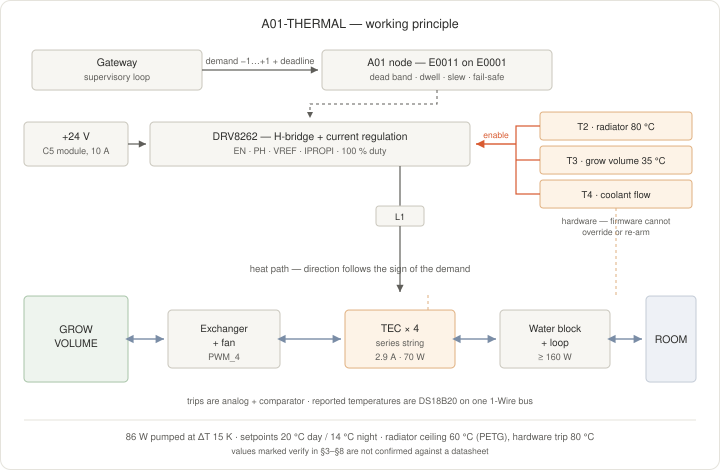

<!--
SPDX-FileCopyrightText: 2026 The IndustryGrow contributors
SPDX-License-Identifier: CC-BY-SA-4.0
-->

# A01-THERMAL — module specification

- **Status:** Working specification, pre-schematic capture. `E0011` not laid out, not fabricated
- **Date:** 2026-09-07
- **E-number:** `E0011` · module class ID `0x80`
- **Governing ADRs:** ADR-0031, ADR-0014 (rev 4), ADR-0015, ADR-0016, ADR-0017 (rev 2), ADR-0018, ADR-0003
- **Companions:** `M01-CLIMATE-specification.md`, `M05-SAFETY-specification.md`, `M06-VENTILATION-specification.md`, `M07-AMBIENT-specification.md`

Rationale for the decisions applied here is in the governing ADRs and is not restated.
Values marked `verify` are not confirmed against the manufacturer datasheet.

## 1. Scope

Requirements for the A01-THERMAL actuator module in the indoor deployment variant: commanded
quantities, actuator complement, drive, interfaces, power, thermal, interlock, mechanical and
firmware requirements, and their verification.

Not specified here: carrier design (`store/E0001-VVVVVV-D-pinmap.md`), the outdoor deployment
variant, the cultivation setpoints themselves (`profiles/strawberry-day-neutral-v1.json`),
control-loop structure and gains (ADR-0015 d8/d18, `gateway/control_model.py`), the
rejection-loop plumbing as a purchased assembly, the outdoor deployment variant.

## 2. Identification

| | Value |
|---|---|
| Module class | A01-THERMAL |
| Module class ID | `0x80` — first actuator class (ADR-0031 d1, d2; range per ADR-0014 rev 4 d6) |
| ID transport | Serial EEPROM, 24Cxx class, byte 0, I²C `0x50` (ADR-0014 d6). The 3-bit strap cannot express `0x80` |
| E-number | `E0011` — first assembly. A populate variant takes its own assembly E-number at design commit (ADR-0017 rev 2 d4) |
| Bare design | One layout, one class ID, one firmware image |
| Carrier | `E0001-000100` or later (ADR-0014 d6). **Not `E0001-000003`** — see `O-100` |

### 2.1 Deployment variant — indoor

This document specifies the indoor variant. The outdoor variant is not specified (`O-106`).

| | Indoor |
|---|---|
| Thermal boundary | A cabinet or chamber standing inside a building |
| Ambient | The room enclosing the cabinet — the volume the enclosure exchanges with, one step out (ADR-0014 d4) |
| Ambient air temperature | 15…30 °C (`M07-AMBIENT-specification.md`, indoor variant) |
| Ambient relative humidity | 25…65 %RH (same) |
| Rejection sink | The same room air. Rejected heat re-enters the cabinet's own boundary condition |
| Rejection load into the room | 160 W continuous (`T6`), bounded by `T8` |
| Grow-volume setpoints | 20 °C day, 14 °C night (`profiles/strawberry-day-neutral-v1.json`) |
| Cold-face condensation | Present whenever the face is below the grow-volume dew point; drained per `T7` |
| Field bus leaves the enclosure | No |
| Environmental qualification | Indoor, as M01–M05 |

## 3. Function

A01 drives the grow-volume air temperature bidirectionally against a setpoint issued by the
gateway. It conditions the demand, limits it on its own rejection-side temperature (`D9`), and
executes it (ADR-0015 d18, ADR-0031 d4).

### 3.1 Commanded quantity

| Command | Element | Command range | Expected operating range | Resolution |
|---|---|---|---|---|
| Thermal demand | 4× thermoelectric module, series string | −1.000 … +1.000, signed; positive heats the grow volume | −1.0 … +1.0 | 0.001 (`verify` against DSDL type, `O-102`) |

Full scale corresponds to the string current limit of `D2`, not to the module's `Imax`.

### 3.2 Published quantities

| Published quantity | Sensor | Sensor range | Expected operating range | Accuracy |
|---|---|---|---|---|
| Rejection-side (radiator) temperature | U1 DS18B20, 1-Wire | −55…+125 °C (`verify`) | 20…60 °C, ceiling 60 °C (`D9`) | ±0.5 K over −10…+85 °C (`verify`) |
| Grow-volume-side (exchanger) temperature | U2 DS18B20, same 1-Wire bus | −55…+125 °C (`verify`) | 5…40 °C | ±0.5 K over −10…+85 °C (`verify`) |
| Applied demand echo | — (firmware state) | −1.000 … +1.000 | −1.0 … +1.0 | exact |
| Drive state | — (firmware state) | `off` / `heat` / `cool` / `inhibited` / `tripped` | — | exact |
| Interlock state | `T2`, `T3`, `T4` hardware lines, on `GPIO_1`–`GPIO_3` | `armed` / `tripped` per line | `armed` | exact |

### 3.3 Exclusions

| Quantity | Owning module class |
|---|---|
| Grow-volume air temperature and humidity | M01-CLIMATE |
| Air velocity through the cabinet | M06-VENTILATION |
| Room (ambient) temperature | M07-AMBIENT |
| Cabinet `+12 V` sensor-bus current, door, leak | M05-SAFETY |
| Actuator energy consumption | DIN kWh meter over S0, read by M05 (ADR-0018 d5) |
| Vapour injection | Environmental-actuator module — not yet specified |

## 4. Actuator complement

| Ref | Device | Function | Supply | Rail |
|---|---|---|---|---|
| U1, U2 | DS18B20, 1-Wire, TO-92 or stainless sheath, 12-bit, 750 ms conversion (`verify`) | Reported radiator and exchanger temperature; input to `D9` | 3.3 V | 3V3 |
| RT1 | NTC 10 kΩ B25/85 3435, at the radiator | `T2` trip element | — | — |
| RT2 | NTC 10 kΩ, on a lead in the grow volume | `T3` trip element (ADR-0018 d10) | — | — |
| TEC1–TEC4 | 40 × 40 mm, 127 couple, `Imax` 6.0 A, `Umax` 15.4 V, `Qmax` 57 W at `Th` 25 °C, `ΔTmax` 68 K (`verify`) | Bidirectional heat pump | Series string | `+24 V` actuator |
| U3 | TI DRV8262, HTSSOP-44, **single-H-bridge mode**. 4.5…60 V; 50 mΩ HS+LS; 20 A TEC capability single-bridge; integrated charge pump for 100 % duty; integrated high-side current sense, IPROPI ±4 %; UVLO, CPUV, OCP, OTSD, `nFAULT` | Direction and current regulation in one part (`D2`, `D3`) | 3.3 V logic, `+24 V` power | `+24 V` |
| L1 | Series inductor, string side (`verify` — value from `D4`) | Ripple filter for the driver's off-time chopping | — | — |
| U5 | Comparator, radiator trip on `RT1` (`T2`) | Hardware interlock | 3.3 V | 3V3 |
| U6 | Comparator, grow-volume trip on `RT2` (`T3`) | Hardware interlock (ADR-0018 d10) | 3.3 V | 3V3 |
| U7 | 24Cxx serial EEPROM, I²C `0x50` | Module class ID (ADR-0014 d6) | 3.3 V | 3V3 |
| SF1 | Coolant-flow switch, purchased (`T4`) | Rejection-loop interlock | — | — |

No trip element is a digital part: `T2`, `T3` and `T4` act without the MCU (ADR-0031 d7), so
`U1` and `U2` report and derate but trip nothing. `U3` integrates the high-side current sense,
so no shunt is fitted; the interlocks act on `U3`'s enable, not through it.

Addresses `0x50`–`0x57` are reserved project-wide for the ID EEPROM (ADR-0014 d6); no other
device on this module occupies them.

## 5. Interfaces

| Header signal | Carrier pin | Use |
|---|---|---|
| `PWM_1` | PC6 / TIM3_CH1 | `U3` EN — drive magnitude (`D2`) |
| `PWM_2` | PC7 / TIM3_CH2 | `U3` PH — direction (`D3`) |
| `PWM_3` | PB0 / TIM3_CH3 | `U3` VREF — current limit setpoint, RC-filtered to analog (`D2`) |
| `PWM_4` | PB1 / TIM3_CH4 | Cold-side fan command (`D6`) |
| `OW_DATA` | PA0 | `U1`, `U2` on one 1-Wire bus; external 4.7 kΩ pull-up (`E0001` pin map) |
| `ADC_1` | PC4 | `U3` IPROPI — string current (`D2`) |
| `ADC_2` | PC5 | `U3` `nFAULT` — digital input (`F9`) |
| `GPIO_1` | PA9 | `T2` interlock state (input) |
| `GPIO_2` | PA10 | `T3` interlock state (input) |
| `GPIO_3` | PA15 | `T4` interlock state (input) |
| `GPIO_4` | PB12 | `U3` nSLEEP — driver enable (output) |
| `I2C1_SCL` / `I2C1_SDA` | PB6 / PB7 | ID EEPROM `0x50` |

Module-ID straps `STRAP_0`–`STRAP_2` are not used by this module (`O-100`).

## 6. Drive requirements

| ID | Requirement | Reference |
|---|---|---|
| `D1` | The four modules are wired as one series string. Element voltage is `V = αΔT + IR`; at ΔT = 15 K the string settles at 2.9 A across `+24 V` (`verify`) | `O-103` |
| `D2` | Drive is closed-loop **current**, not duty, regulated by `U3` against the `VREF` setpoint. String current limit 3.0 A (`verify`). `U3`'s integrated sense serves this loop only; no energy or consumption quantity is published from it | ADR-0018 d5 |
| `D3` | Direction reversal is by the `U3` PH input. Reversal is permitted only after the drive has been at zero for `D5` | ADR-0031 d5 |
| `D4` | `U3` off-time chopping is set to one of 7 / 16 / 24 / 32 µs; `L1` is sized so the string sees ripple ≤ 5 % of setpoint current (`verify`) | `O-103` |
| `D5` | Dead band \|demand\| < 0.05 commands zero drive; minimum dwell at zero before a sign change is 60 s (`verify`) | ADR-0031 d5 |
| `D6` | The cold-side fan is a separate command, independently settable from the thermal demand | ADR-0031 d3, d4 |
| `D7` | Demand slew is limited to 0.05 s⁻¹ (`verify`) | ADR-0015 d18 |
| `D8` | A demand whose validity deadline has expired drives the string to zero and the cold-side fan to full | ADR-0031 d6 |
| `D9` | Radiator temperature from `U1` derates the demand: full scale below 50 °C, linear to zero at **60 °C**, re-enable below 45 °C (`verify`). Runs on the node and applies to any commanded value | ADR-0031 d4, `M6` |

## 7. Power

| ID | Requirement | Reference |
|---|---|---|
| `P1` | Node logic is powered from the `+12 V` SELV sensor bus and derives 3.3 V on the carrier. The actuator string is **not** on that rail | ADR-0018 d3 |
| `P2` | The string is fed from the `+24 V` actuator section: TDK-Lambda Vega 650 (`K60050B`), C5 module, 24 V 10 A. Chassis total 650 W is shared across fitted modules (`verify`) | ADR-0018 d3, `O-104` |
| `P3` | String draw at `D2` limit: 70 W, 2.9 A (`verify`). One C5 module carries the string with the balance available to other branches | `D1` |
| `P4` | Per-branch overcurrent protection is the supply module's own current limit plus `U3` OCP; no central per-load fuse | ADR-0018 d8 |
| `P6` | `U3` dissipates 0.45 W at the `D2` limit (50 mΩ HS+LS × 3.0 A²). The thermal pad is bonded to a copper pour sized for it (`verify`) | `U3` |
| `P5` | The switched return is not shared with the logic or analog ground at the module. Isolation of the command path lives at this actuator | ADR-0018 d7, d8 |

## 8. Thermal requirements and interlocks

| ID | Requirement | Reference |
|---|---|---|
| `T1` | Cooling capacity ≥ 85 W at ΔT = 15 K, hot face ≤ 45 °C (`verify`). Sufficiency against the cabinet loss coefficient is unresolved until identification | `O-105` |
| `T2` | **Radiator over-temperature trip** (self-protective), independent of the MCU, gateway and cloud: `RT1` → `U5` → driver enable. Trip at 80 °C (`verify`; module solder limit 138 °C for Bi-Sn, `verify`), 20 K above the `D9` ceiling | ADR-0031 d7 |
| `T3` | **Grow-volume over-temperature trip** (process-protective), independent of the MCU, gateway and cloud: `RT2` → `U6` → driver enable. Trip at 35 °C (`verify`) | ADR-0018 d10, ADR-0031 d7 |
| `T4` | **Coolant-flow interlock** (self-protective): loss of flow in the rejection loop removes driver enable in hardware | ADR-0031 d7 |
| `T5` | `T2`, `T3` and `T4` act on the driver enable directly. Firmware reads their state but cannot override or re-arm any of them | ADR-0015 d11, ADR-0018 d10 |
| `T6` | Rejection loop dissipates ≥ 160 W continuous at a coolant-to-room ΔT of 15 K (`verify`) | `D1`, `T1` |
| `T7` | Condensate forming on the grow-volume face is collected and drained clear of the volume | `O-107` |
| `T8` | The room absorbs the `T6` rejection load with an ambient rise ≤ 2 K (`verify`). Ambient outside 15…30 °C is outside this variant | §2.1 |

## 9. Mechanical requirements

| ID | Requirement | Reference |
|---|---|---|
| `M1` | Each module is clamped between a grow-volume-side finned heatsink and a rejection-side cold plate, with the clamping force from the datasheet (`verify`) | `O-103` |
| `M2` | Both faces carry a thermal interface material rated for continuous 100 °C (`verify`) | `O-103` |
| `M3` | The assembly penetrates the cabinet wall; the penetration is sealed and thermally broken so the two faces do not short around the module | `O-107` |
| `M4` | The grow-volume-side heatsink is positioned in the circulation path, not in still air | ADR-0003 air movement |
| `M5` | `RT2` reaches the grow volume on a lead; no I²C crosses that lead | ADR-0014 d3, ADR-0018 d10 |
| `M6` | Printed parts are PETG. No printed part is in direct thermal contact with a TEC hot face, the radiator or the water block, and no printed surface exceeds **60 °C** continuous (`verify` — PETG HDT ≈ 70 °C at 0.45 MPa) | `O-107` |

## 10. Firmware requirements

| ID | Requirement | Reference |
|---|---|---|
| `F1` | Read the class ID from EEPROM `0x50` byte 0 at boot. `0x00` and `0xFF` are *unidentified*, never a class | ADR-0014 d6 |
| `F2` | Enumerate the 1-Wire bus at boot and publish only the quantities in §3.2 whose devices respond | ADR-0014 d2 |
| `F3` | The inner loop runs on the node at the actuator's rate; the gateway issues the demand and its validity deadline only | ADR-0015 d18 |
| `F4` | Enforce `D2`, `D5`, `D7`, `D8` and `D9` in node firmware, independently of the commanded value | ADR-0015 d18 |
| `F8` | Loss of `U1` for more than 5 s (`verify`) is treated as the `D9` ceiling reached | `D9` |
| `F9` | A `U3` `nFAULT` assertion drives the string to zero, is published as drive state `fault`, and is latched until the node is reset | `U3` |
| `F5` | Publish the trip state of `T2`, `T3` and `T4`. A trip is reported and latched in telemetry until the node is reset | `T5` |
| `F6` | Publish no energy or consumption quantity | ADR-0018 d5 |
| `F7` | Deployment constants — current limit, dead band, dwell, slew, fan mapping — are node-local and set at commissioning, not carried in the profile | ADR-0015 d18, ADR-0028 |

## 11. Verification

| ID | Verifies | Method |
|---|---|---|
| `V1` | `D1`, `P3` | Measure string current and voltage at 24 V against a hot face held at 25 °C; record the ΔT–current curve |
| `V2` | `D2`, `D4` | Measure string current and its ripple at 25 %, 50 % and 100 % of the limit with a current probe; cross-check against IPROPI |
| `V3` | `D3`, `D5` | Command a sign reversal; confirm zero drive is held for the dwell and that no reversal occurs inside it |
| `V4` | `D7`, `D8` | Command a step to full scale; confirm slew. Stop publishing the demand; confirm the string reaches zero and the fan full within the deadline |
| `V5` | `T1`, `T6` | Step the string to the limit into a cabinet at a known start temperature; record the pull-down curve and the coolant rise |
| `V6` | `T2` | Heat the hot-face thermistor past the trip with the MCU held in reset; confirm driver enable is removed |
| `V7` | `T3` | Heat `RT1` past the trip with the MCU held in reset; confirm driver enable is removed |
| `V8` | `T4` | Stop coolant flow with the string at the limit; confirm driver enable is removed |
| `V9` | `T5` | Attempt to re-arm each trip from firmware; confirm it cannot |
| `V10` | `T7` | Run at the cooling limit with the grow volume above dew point for 4 h; confirm no free water inside the volume |
| `V11` | `F1` | Read the published class ID; confirm `0x80` |
| `V12` | `D6` | Command fan and thermal demand independently; confirm neither forces the other |
| `V13` | `D9`, `F8` | Raise the radiator past 50 °C with the demand at full scale; record the derate curve and the 60 °C clamp. Disconnect `U1`; confirm the clamp |
| `V14` | `T8` | Run at the `T6` rejection load for 4 h in the installed room; record the ambient rise |
| `V15` | `M6` | Thermograph the printed parts at the `T6` rejection load; confirm no surface exceeds 60 °C |
| `V16` | `F9` | Force a `U3` fault (short an output at reduced `VREF`); confirm zero drive, the published state, and the latch |
| `V17` | `P6` | Measure `U3` case temperature at the `D2` limit for 1 h |

## 12. Open items

- `O-100` — Actuator class IDs require the EEPROM transport, so A01 cannot run on carrier `E0001-000003` (ADR-0031 d10). The `E0001-000100` pin map must also carry the 1-Wire line §5 claims (ADR-0014 rev 4 deferred item). Blocks fabrication.
- ~~`O-101`~~ — ~~No actuator-taxonomy ADR (ADR-0014 d9). Blocks ratification of `D3`, `T2`, `T4` and the `A0x` class-naming form.~~ — closed 2026-09-07 by ADR-0031.
- `O-102` — No DSDL type for a signed actuator demand with a validity deadline. Blocks `F3`.
- `O-103` — Thermoelectric module not selected; α, R, K, clamping force and TIM are unconfirmed, and `L1` follows from them. `U3` continuous RMS current by package is unread. Blocks `D1`, `D4`, `M1`, `M2`.
- `O-104` — Vega 650 startup, inhibit and output-isolation behaviour unconfirmed against the manual. Blocks `P2`.
- `O-105` — Cabinet loss coefficient unidentified (ADR-0016 survey). Blocks sufficiency of `T1`.
- `O-106` — Outdoor deployment variant not specified.
- `O-107` — Wall penetration, thermal break and condensate drain are mechanical design. Blocks `M3`, `T7`.

## 13. Maturity

| Rung | State |
|---|---|
| **Pre-schematic** | **Current.** Complement and requirements fixed; values estimated or `verify` |
| Schematic-frozen | Not reached |
| As-built | Not reached |

Next rung requires: `O-103` closed (module selected, datasheet values substituted), `O-104`
closed, `O-102` closed, and `D2`/`D4`/`D9` component values — `L1`, `VREF` divider, `U3` off-time — computed against the selected module.
